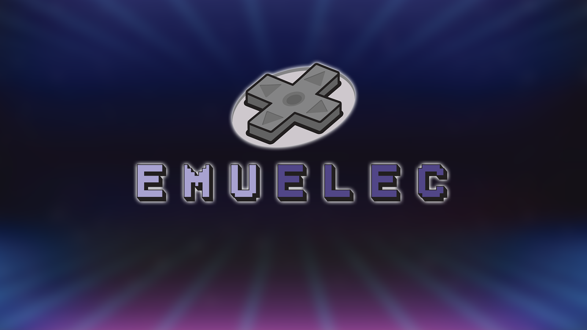

## EmuELEC 是什么

用于 Amlogic 设备的复古怀旧游戏的模拟。基于 [CoreELEC ](https://github.com/CoreELEC/CoreELEC)和 [Lakka ](https://github.com/libretro/Lakka-LibreELEC)以及 [Batocera ](https://github.com/batocera-linux/batocera.linux)。只是将它们与 [Batocera-Emulationstation ](https://github.com/batocera-linux/batocera-emulationstation)和一些独立的模拟器（ [Advancemame ](https://github.com/amadvance/advancemame)、[PPSSPP](https://github.com/hrydgard/ppsspp)、[Reicast](https://github.com/reicast/reicast-emulator)、[Amiberry](https://github.com/midwan/amiberry) 等）结合起来。

## 支持的设备

几乎所有 Amlogic S905、S905x2、S905x3、S922x/A311D 及其变体，包括：

### S905、S905x、S905l、S912 等 

- 大部分 S905、S905x、S905l 等的 Android 电视盒子 
- Odroid C2
- Le Potato

### S905x2、S905x3、S922x、A311D 

- Odroid N2
- VIM3
-  Beelink Gt-King / Gt-King Pro 
- Beelink GS-King X
- Beelink GT1 Mini2 (S905x3)
- Odroid C4 (S905x3)
- 其他采用 S905x2、S905x3 和 S922x、A311D 芯片的电视盒子

### 瑞芯微 Rockchip

- Odroid-GO Advance
- Odroid-GO Super
- GameForce

即使芯片支持 EmuELEC，但还是可能会遇到一些无法启动的设备。

## 单机版和插件版

- 单机版

为希望将其 Amlogic 设备用作成熟的仿真模拟器系统的人们而设计的，功能较为齐全，它包含更多高级和自定义的选项。个人推荐使用单机版更好。

- 插件版

旨在提供那些想要偶尔玩模拟器，而不用更改其 CoreELEC 安装，并且无需关心高级选项和定制。插件版本的最大优势是可以保留 Kodi。

---

本系列教程适用于 EmuELEC 4.0 之后的版本，是以 EmuELEC 4.3 为例进行操作说明。
