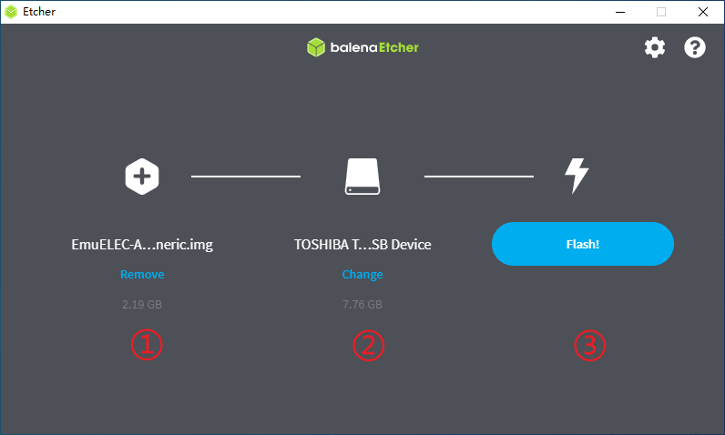
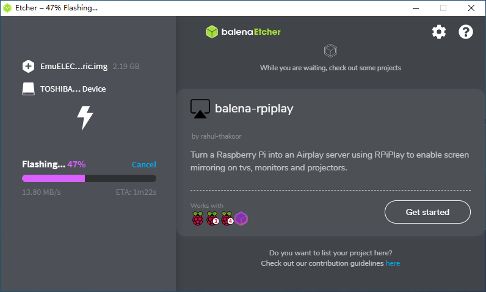
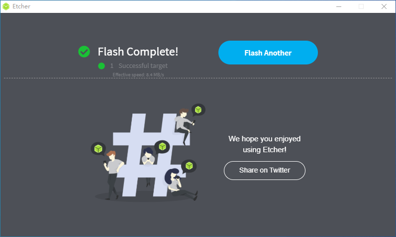
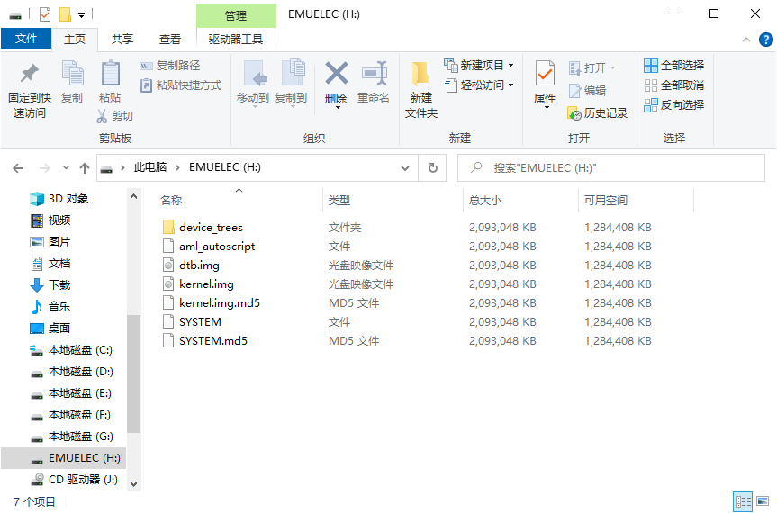
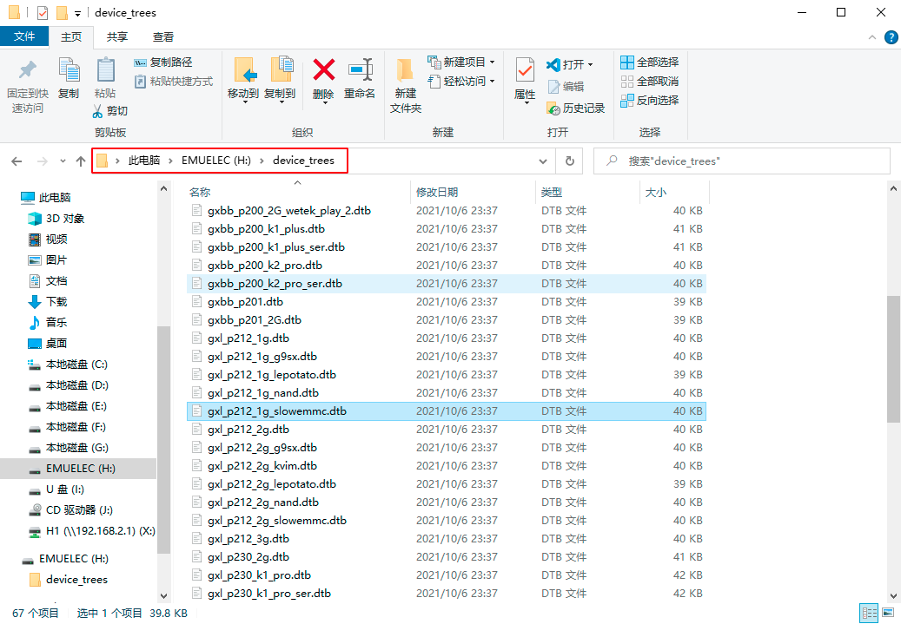
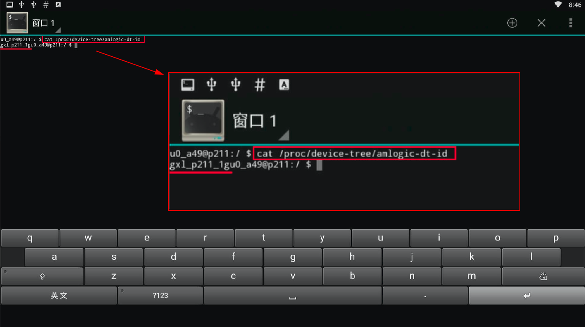

## 下载镜像

到[EmuELEC开源项目](https://github.com/EmuELEC/EmuELEC/releases)下载对应设备的镜像，或者到本站提供的网盘链接下载（只提供通用版本）。

- `EmuELEC-Amlogic.aarch64-xxx-generic.img.gz` 适用于 S905、S905x、S905l、S905w 等
- `EmuELEC-Amlogic-ng.aarch64-xxx-generic.img.gz` 适用于 S905x2、S905x3、S922x、A311D（注意 `ng`） 
- `EmuELEC-OdroidGoAdvance.aarch64-xxx-odroidgo2.img.gz` 适用于 Odroid-GO Advance 和 Odroid-GO Super 
- `EmuELEC-GameForce.aarch64-xxx-chi.img.gz` 适用于 GameForce

根据自己设备的芯片型号，来下载对应的镜像。

本教程是以百视通R3300L为例来写的，因此需要下载`EmuELEC-Amlogic.aarch64-xxx-generic.img.gz` 镜像。

## 烧录镜像

准备一张容量大小适当的TF卡/U盘，并准备好镜像烧录工具（推荐 [Etcher](https://www.balena.io/etcher/)）。

1. 首先把下载好的镜像包`EmuELEC-Amlogic.aarch64-4.3-Generic.img.gz`解压缩，得到镜像文件`EmuELEC-Amlogic.aarch64-4.3-Generic.img`

2. 打开镜像烧录工具 Etcher

   ①选择刚刚解压缩后的镜像文件；

   ②选择要烧录到的TF卡/U盘；

   ③点击【Flash】按钮进行烧录。

   

3. 等待烧录完成

   

4. 完成如下图，如有提示格式化磁盘之类的弹窗，请选择【NO】

   

## 替换DTB文件

烧录完成后，会出现一个新的EMUELEC分区，打开后如下图所示，其中`dtb.img`（设备树文件）是需要替换为你的设备相匹配的`dtb.img`文件。



打开`device_treess`目录，里面有很多常见的DTB文件，找到对应的DTB文件重命名为`dtb.img`并替换EMUELEC分区根目录的`dtb.img`文件。



::: tip 补充

- 如何确认设备的DTB

如果你的设备已经装了Android系统，那么安装一个Terminal，输入如下命令：

```shell
$ cat /proc/device-tree/amlogic-dt-id
gxl_p211_1g
```



**gxl_p211_1g**就是你的设备所需要的DTB文件的名称（没有就找名称相似、接近的）；如果此方法不成功，就只能一个一个尝试；再不行就是没有专用的DTB文件，放弃吧。（p211是板子型号，1g是内存大小，1gbit是千兆网口）

- 切换系统

在上述操作时，可以顺便安装一个`Reboot to LibreELEC.apk`软件，方便从Android系统切换到EmuELEC系统。

:::

以上，EmuELEC系统启动盘就制作好了，把制作好的启动盘插到你的设备上，设置引导TF卡/U盘启动，就会进入EmuELEC系统了。
