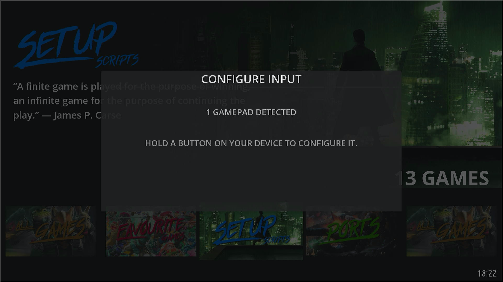
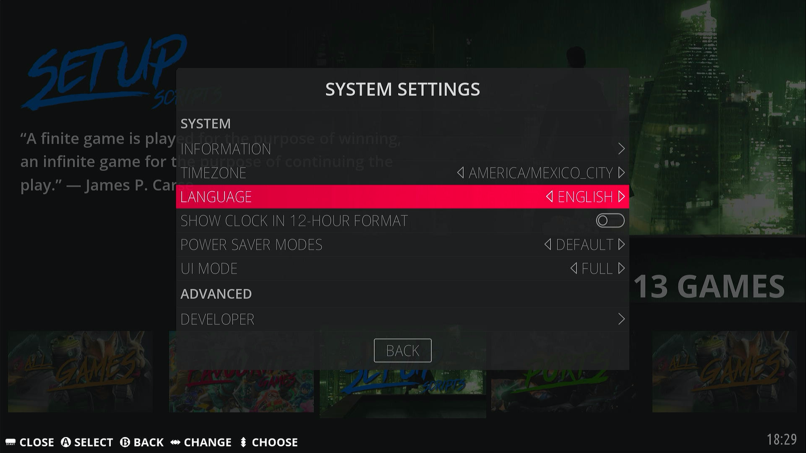
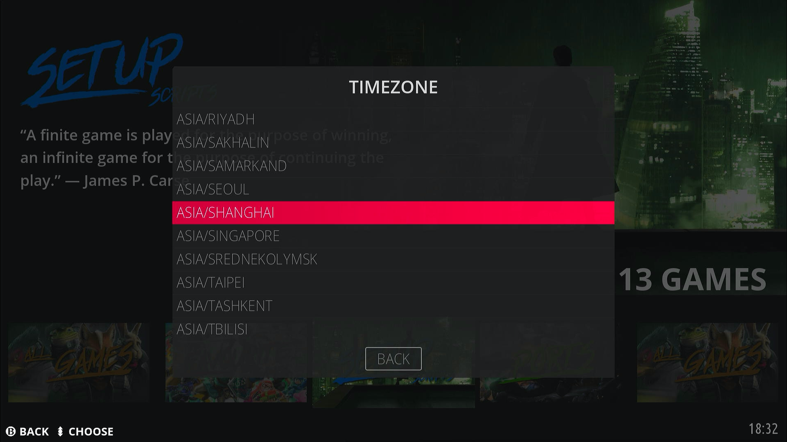

## 进入系统

从TF卡/U盘顺利启动，启动画面如下，正在扩容分区，格式化等操作，完成后会自动重启

重启后，开始进入系统，第一次系统加载时间会长一些，耐心等待

经过耐心的等待，顺利进入系统，画面如下

## EmulationStation设置

### 手柄映射

手柄连接到设备上，系统会自动识别到，长按手柄上任意一个按键来映射手柄

按照提示映射你的手柄

### 语言时区设置

按下手柄的<kbd>START</kbd>键调出主菜单【MAIN MENU】，选择【SYSTEM SETTINGS】

> 手柄<kbd>A</kbd>键为确认，<kbd>B</kbd>键为返回。

选择【LANGUAGE】

选择【简体中文】

返回到【SYSTEM SETTINGS】，选择【TIMEZONE】

选择【ASIA/SHANGHAI】

然后再返回到【SYSTEM SETTINGS】，确认语言和时区

再次按手柄<kbd>B</kbd>键返回，跳出【EmulationStation will restart】提示，选【YES】

然后 EmulationStation 重启之后，语言和时区就变成所设定的语言和时区了。

### 网络设置

连接网络有两种方式，一是有线网络，二是无线WiFi，有线直接将网线接入设备即可，下面来说说WiFi的连接设置。

按下手柄的<kbd>START</kbd>键调出【主菜单】，选择【网络设置】

打开【启动WIFI】

然后输入【WiFi名称】和【WiFi密码】来连接WiFi

退出【主菜单】再重新进入，可以看到最下面有了IP地址（记住，后面会用到），或者屏幕右上角的WiFi图标出现，说明WiFi连接成功

## RetroArch设置

### 中文界面设置

使用ssh登陆工具（MobaXterm、WinSCP之类）登陆到你的设备

打开MobaXterm，点击【Start local terminal】开启一个本地终端

输入命令`ssh root@192.168.x.y`，如需输入密码，密码为emuelec

> 192.168.x.y是你设备的IP地址，就是上面连接网络获取到的IP地址。
>
> 连接成功后如下图所示，左侧红框是EmuELEC设备的目录结构。

进入下图左上红框的位置：`/tmp/assets/ozone/`，替换这两个字体文件。

> 字体文件放在本站的【资源下载】中，将下载好的字体文件直接拖拽进去即可，左下方会有上传进度显示，有替换提示框选yes；如果没有替换这两个字体，直接更改语言为中文的话，文字则会显示不全，有方块乱码。
>

按下手柄的<kbd>SELECT</kbd>键调出【快速进入】菜单，选择【重启RetroArch】

进入到RetroArch，选择【Settings】➡【User】

选择【Language】➡【简体中文】

返回到主界面再选择【设置】➡【界面】

选择【显示高级设置】更改为【ON】

返回到主界面再选择【菜单】➡【配置文件】

选择【保存当前配置】

返回到主界面再选择【菜单】➡【退出程序】

以上，RetroArch界面语言更改就完成了，再次进入RetroArch，完美显示中文。

### 中文消息设置

但是，当我们在RetroArch中进行一些操作触发通知消息时，显示的中文有乱码，如下：

进入下图左上红框的位置：`/storage/.config/retroarch/`，双击打开`retroarch.cfg`配置文件

在打开`retroarch.cfg`的编辑器中点击🔍按钮，输入`video_font_path`查找

把找到的那行等于号后面的路径更改为：`"/tmp/assets/ozone/regular.ttf"`，然后保存

再次触发通知消息时，显示的中文正常了。

当然，关于EmuELEC的基本设置还有许多，这里就不一一列举了，感兴趣的小伙伴可以自己去尝试各项功能。
