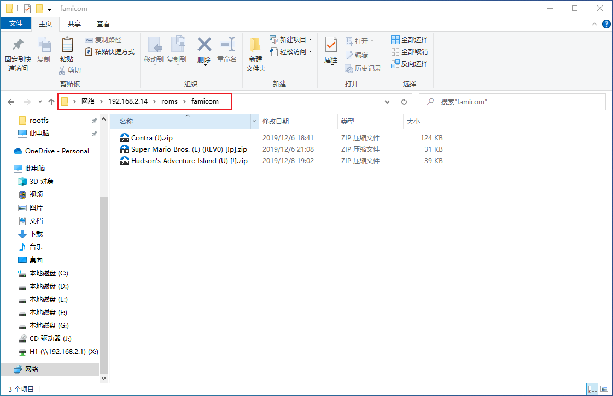

之前关于EmuELEC的基本设置已经说明过了，现在就说说如何添加游戏ROM。

## ROM存放目录

首先找到EmuELEC系统存放游戏ROM的路径，在同一局域网下的电脑上，打开【计算机】，在地址栏输入【EmuELEC的IP地址】后回车

就进入到EmuELEC系统的资源目录了，`roms`就是存放游戏ROM的目录

> `roms`下有很多文件夹，大部分是模拟器平台对应的目录

## 放入游戏ROM

例如：进入`roms/famicom`目录（任天堂红白机），放入几个游戏ROM文件

按下手柄的<kbd>SELECT</kbd>键调出【快速进入】菜单，选择【重启EmulationStation】

会发现主界面多了一个【Family Computer】游戏平台

进入【Family Computer】游戏平台，有显示刚刚放进去的3个游戏

进去试玩一下，可以正常游戏

> 退出游戏：按两次 <kbd>SELECT</kbd>+<kbd>START</kbd> 组合键

试玩游戏之后，会在该平台ROM目录下自动生成一个`gamelist.xml`的文件，这个就是游戏列表，暂且不提，之后会作详细说明

## 需要BIOS的游戏平台

再例如，进入`roms/neogeo`，放入两个游戏ROM文件

再次按下手柄的<kbd>SELECT</kbd>键调出【快速进入】菜单，选择【重启EmulationStation】

会发现主界面又多了一个【NEO·GEO】游戏平台

进入【NEO·GEO】游戏平台，有刚刚放进去的2个游戏

选择一个游戏试玩一下，但不能进入游戏，出现如下图报错，查看报错原因是没有BIOS文件`neogeo.zip`

## 添加BIOS文件

进入`roms/bios`，把NEOGEO模拟器的BIOS文件`neogeo.zip`放入该目录

再次尝试进入游戏，可以正常进入游戏

同样，NEOGEO平台游戏ROM目录下也自动生成一个`gamelist.xml`游戏列表文件

以上，就是关于EmuELEC添加游戏ROM的说明。

::: tip 关于BIOS文件

有一些模拟器平台是需要BIOS文件的，有一些模拟器平台是不需要的，这个具体可以网上查找相关内容，当然，在本站的【资源下载】的网盘中提供大多数模拟器所需的BIOS文件，下载后直接放入`roms/bios`中即可。

:::
