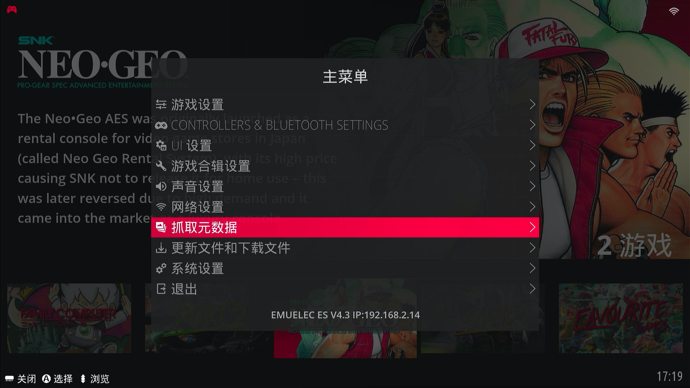

游戏ROM添加了，也可以正常游戏了。但是添加的游戏比较多的情况下，想知道选择的游戏更详细的信息，该怎么办呢？下面来说说抓取游戏ROM信息。

## 抓取元数据

按下手柄的<kbd>START</kbd>键调出【主菜单】，选择【抓取元数据】

根据需求选择抓取哪些数据（手册和地图一般不抓取），并输入【用户名】和【密码】，选择【开始抓取】

> 游戏数据来源默认使用【ScreenScraper】，信息最全，也是推荐使用的
>
> 关于【用户名】和【密码】，需要注册账号，具体参考本文最后的ScreenScraper注册

根据需求选择抓取游戏平台，然后选择【开始】

屏幕右上角出现抓取进度信息，等待抓取完成

## 更新游戏列表

抓取完成后，按下手柄的<kbd>START</kbd>键调出【主菜单】，选择【游戏设置】

选择【是】更新游戏列表

更新游戏列表后，再次进入游戏平台列表，抓取到的游戏都有了更详细的信息（包含游戏名称、介绍、图片、logo、视频等）

当然，上面抓取的信息都是英文，如想要修改，那就需要对游戏列表文件`gamelist.xml`进行修改，后面再具体说明，此处略过。

::: tip ScreenScraper注册

打开[ScreenScraper](https://www.screenscraper.fr/)官方网站，点击【Register】跳转到注册页面

注册页面往下滚动，到下图的红框处填写注册信息，然后点【SEND】提交即可完成注册

:::
