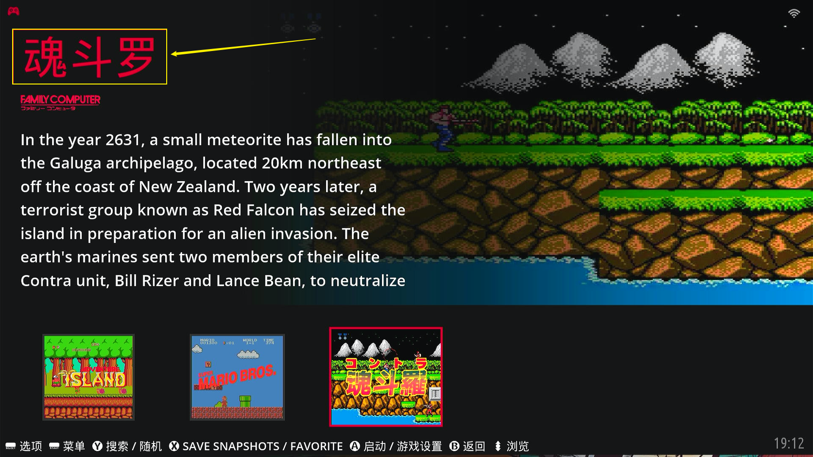

在上一片有提到`gamelist.xml`文件，也就是游戏列表，下面我们具体说说这个游戏列表文件。

## 抓取到的文件

当我们把游戏ROM抓取完成之后，进入到游戏ROM所在目录，会发现多出了几个子目录：

- `images`：抓取到的游戏ROM对应的<u>游戏截图</u>、<u>游戏logo</u>、<u>游戏封面</u>以及<u>游戏同人图片</u>

- `videos`：抓取到的游戏ROM对应的<u>游戏视频</u>

- `manuals`：抓取到的游戏ROM对应的<u>游戏手册</u>（一般不抓取，都是外文看不懂）


`images`、`videos`目录下，抓取到的图片和视频


## 游戏列表说明

游戏列表文件`gamelist.xml`也更新了。打开列表文件看看：


`gamelist.xml`与没抓取游戏ROM信息之前（参考第三篇文章）相比，多出了很多内容，如：游戏画面、游戏视频、游戏logo、游戏封面......

其实需要修改的地方，也就一个`<name>游戏名</name>`元素标签，比如将游戏<u>**Conrta (J)**</u>改成中文的<u>**魂斗罗**</u>，设定换行符为<u>Unix/macOS(LF)</u>，再保存一下


然后手柄按<kbd>START</kbd>键盘调出【主菜单】➡【游戏设置】➡【更新游戏列表】

再次进入游戏平台看看，游戏名称变成了中文<u>**魂斗罗**</u>，其他游戏按照此方法修改即可



方法都很简单，但是数量多的话还是要花很长时间的，会写函数脚本工具的就可以很方便快速的搞定，其实写工具也不是太难，难得是要有中英文对照数据才好写工具。

::: tip xml格式说明

> 必须有xml声明语句；
>
> 必须有且仅有一个根元素；
>
> 标签大小写敏感；
>
> 标签成对；
>
> 必须正确地嵌套；
>
> 属性值用双引号；
>
> ...

```xml
<?xml version="1.0"?>			<!--第一行是xml的声明-->
<gamelist>						<!--根元素gamelist的开始标签-->
	<game id="18624">				<!--gamelist的子元素game的开始标签-->
		<path></path>					<!--game的子元素path（一对标签）-->
		<name></name>					<!--game的子元素name（一对标签）-->
		...								<!--...-->
		<region></region>				<!--game的子元素region（一对标签）-->
	</game>							<!--根元素gamelist的子元素game的结束标签-->
	...								<!--...-->
	<game id="18624">				<!--同上-->
		<path></path>
		<name></name>
		...
		<region></region>
	</game>
</gamelist>						<!--元素gamelist的结束标签-->
```

:::
