细心的朋友会发现，很多游戏在玩的时候，显示器两边会有黑边，看起来有些突兀。其实有个功能可以解决这个问题的，那就是接下来要说的边框（bezel）。

::: tip 为什么会有黑边？

小时候玩游戏，那时的老电视的屏幕比例基本都是4:3，但现在的显示器，液晶电视的屏幕比例基本都是16:9。用现在的显示器或液晶电视玩这些老游戏，屏幕两边就产生了黑边。

:::

## 开启边框

首先手柄按<kbd>START</kbd>键调出【主菜单】，选择【游戏设置】

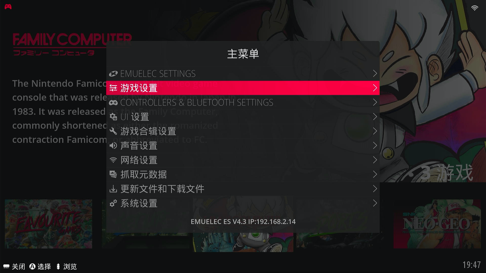

打开【启用RA边框】

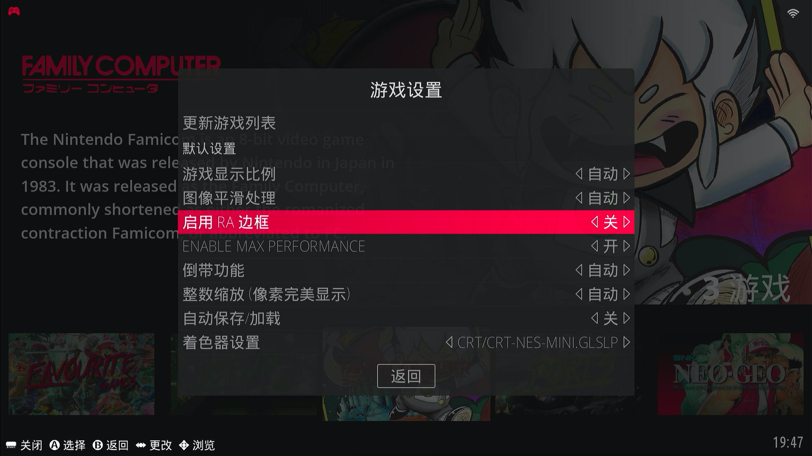

然后再进入游戏看看效果

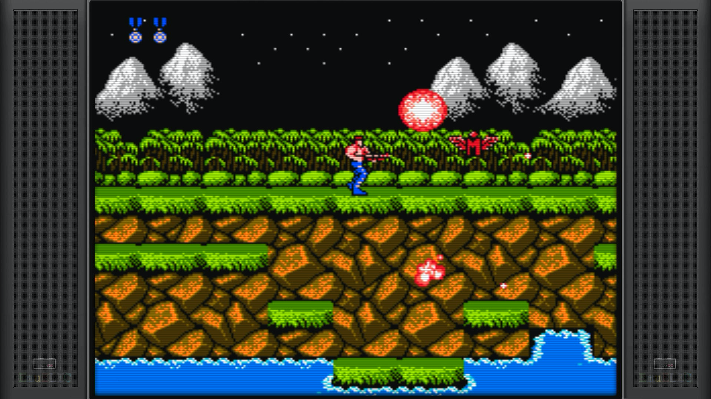

所有游戏都是这个边框，这个边框是EmuELEC系统自带的，暂且称之为<u>**系统边框**</u>

那可不可以增加其他的边框呢？当然可以

## 下载边框

手柄按<kbd>START</kbd>键调出【主菜单】，选择【更新文件和下载文件】

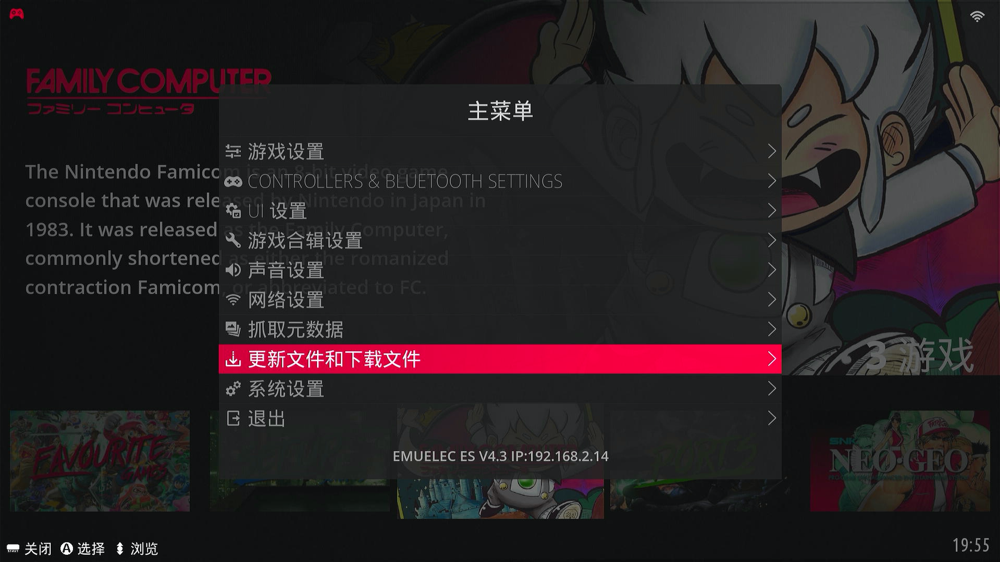

选择【框架项目】

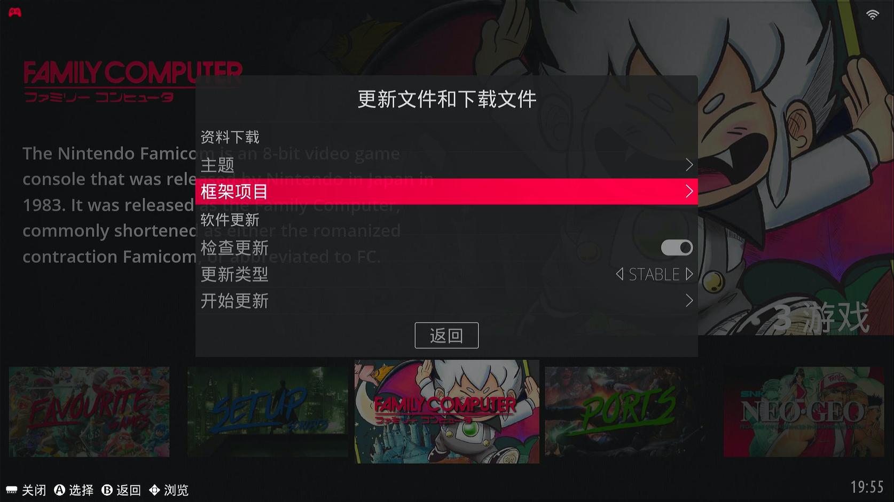

选择要下载的游戏平台进行下载（右上方有下载进度）

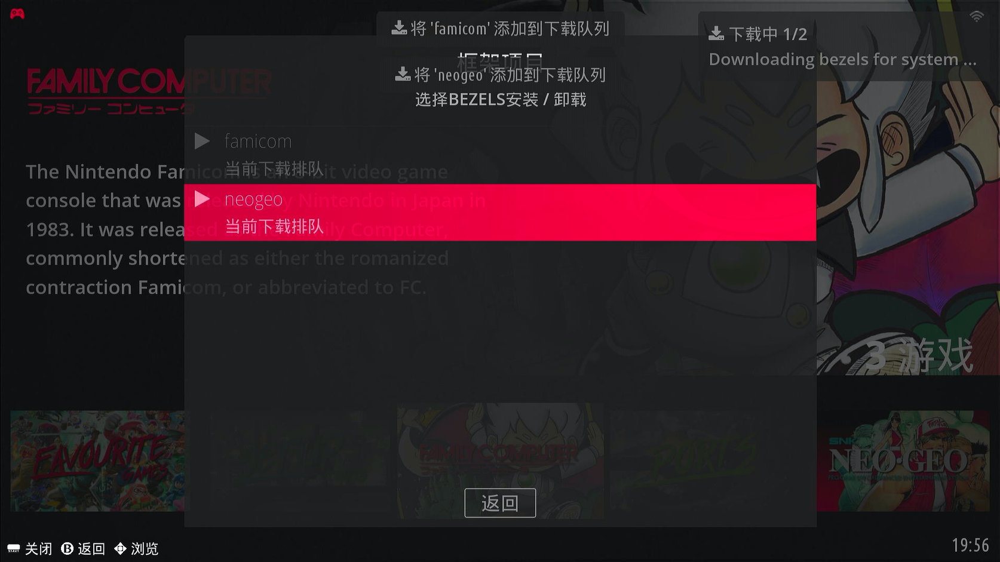

## 边框效果

下载完成后，再进入游戏看看效果

### Famicom平台

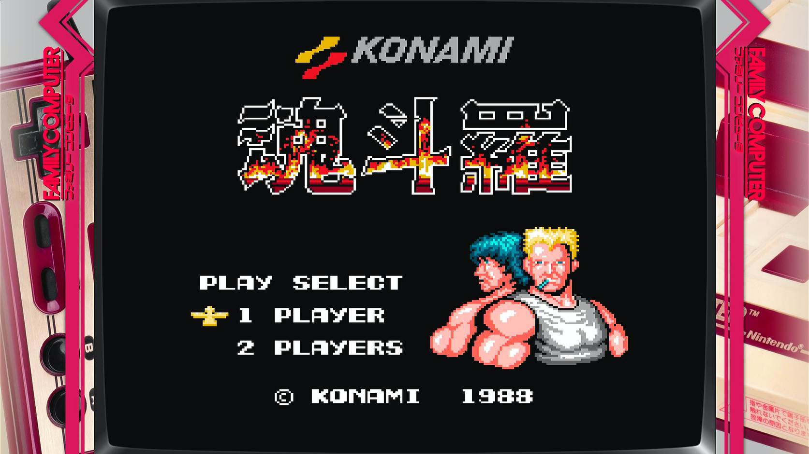

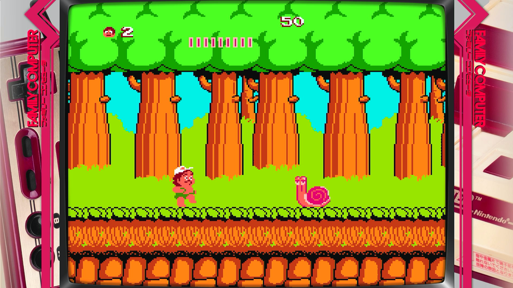

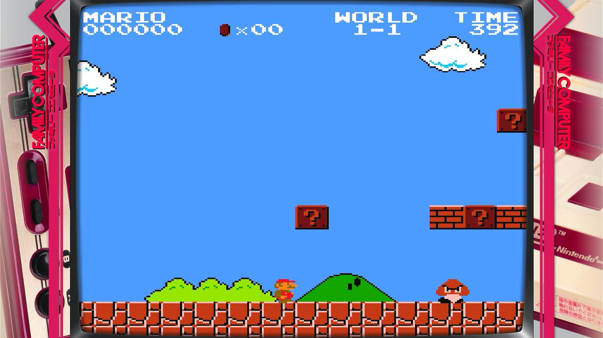

### NEO·GEO平台

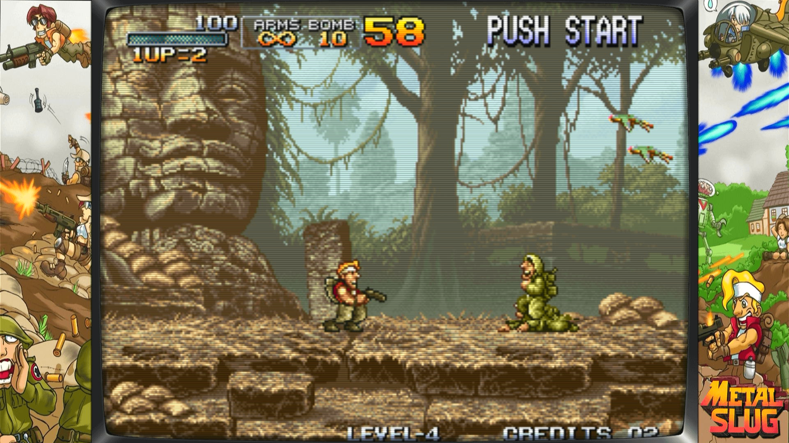

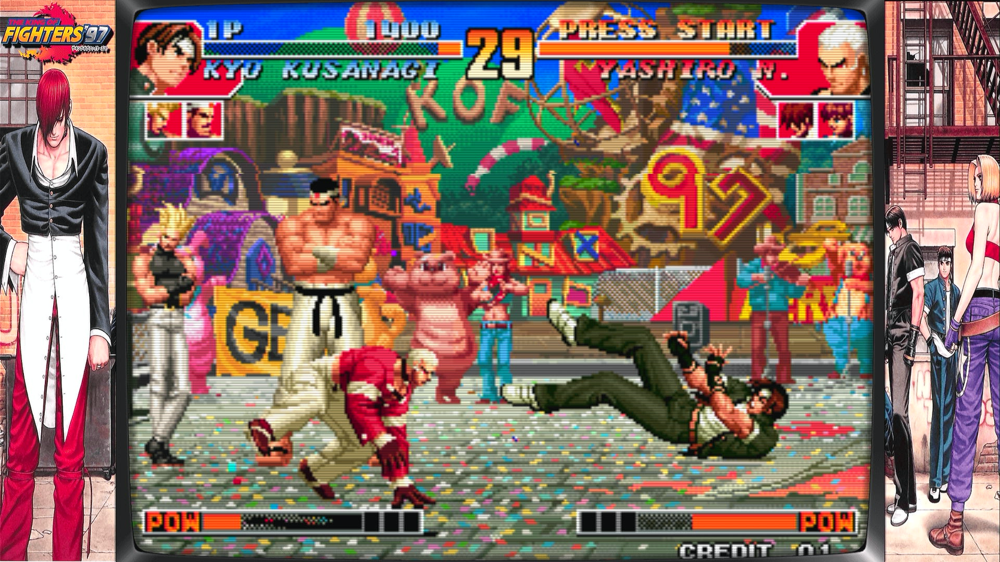

## 边框及其配置

细心的小伙伴会发现，这两个游戏平台的边框有些不一样，为什么Famicom的所有游戏都是一样的边框；而NEO·GEO的每一个游戏的边框都不一样。那我们看看边框的所在目录：`roms/bezels`

新增了如下图红框的文件及文件夹

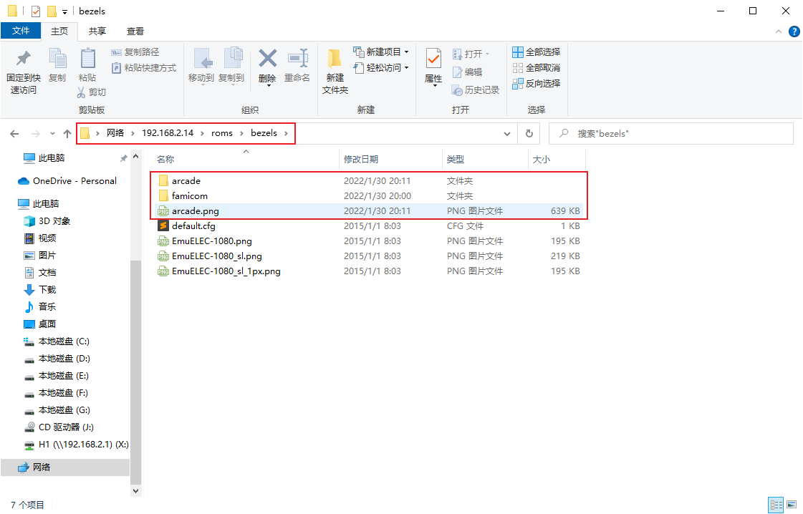

首先进入到`roms/bezels/famicom`目录看看，里面只有两个文件：

`default.cfg`和`default.png`

这种命名为default的图片和配置文件，暂且称之为<u>**平台边框**</u>，就是说在这个平台的所有游戏都使用这个default边框

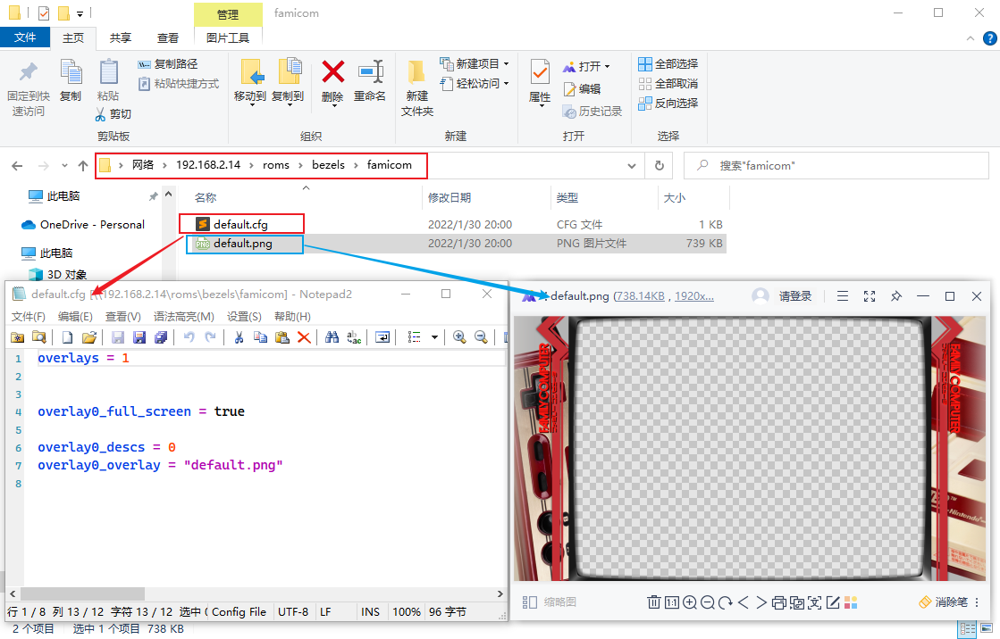

再进入到`roms/bezels/arcade`目录看看，里面的文件就不一样了

`kof97.cfg`和`kof97.png`、`mslug.cfg`和`mslug.png`

这里的边框名称是根据游戏ROM名来命名的，就是说每个游戏都有自己单独的一个边框，打开其中一个游戏的看看（如下图），这种根据游戏ROM名来命名的边框，暂且称之为<u>**游戏边框**</u>

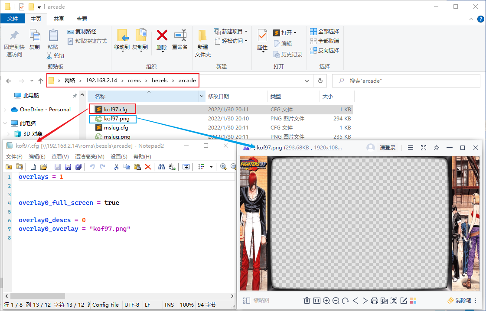

::: tip 疑问

为什么NEO·GEO平台的游戏边框目录是`roms/bezels/arcade`呢？而不是`roms/bezels/neogeo`呢？

这个问题很好，这是为什么呢？因为系统默认是把arcade、bneo、fbn、neogeo、mame、cps1、cps2、cps3这几个平台合并到一起，统一用`roms/bezels/arcade`作为它们的边框目录。

:::

边框的所在目录`roms/bezels`下还有一个文件`arcade.png`，我们再来测试一下（仅作测试，请谨慎尝试）：

1. 把`roms/bezels/arcade.png`移动到`roms/bezels/arcade`并改名为`default.png`

2. 把`roms/bezels/famicom/default.cfg`复制到`roms/bezels/arcade`目录下

3. 删除`roms/bezels/arcade`目录下的`mslug.cfg`和`mslug.png`

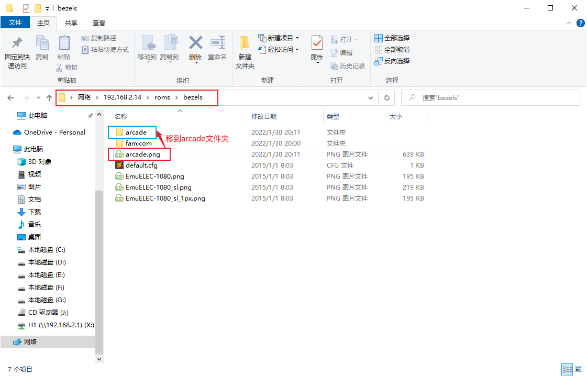

完成后如下

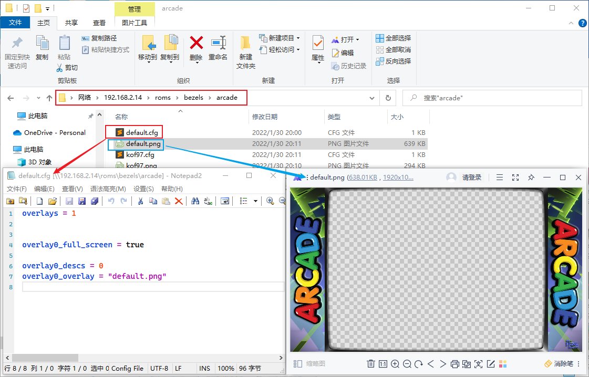

再次进入游戏合金弹头（`mslug.zip`，边框已经删除），发现边框是`roms/bezels/arcadedefault.png`，即启用了平台边框

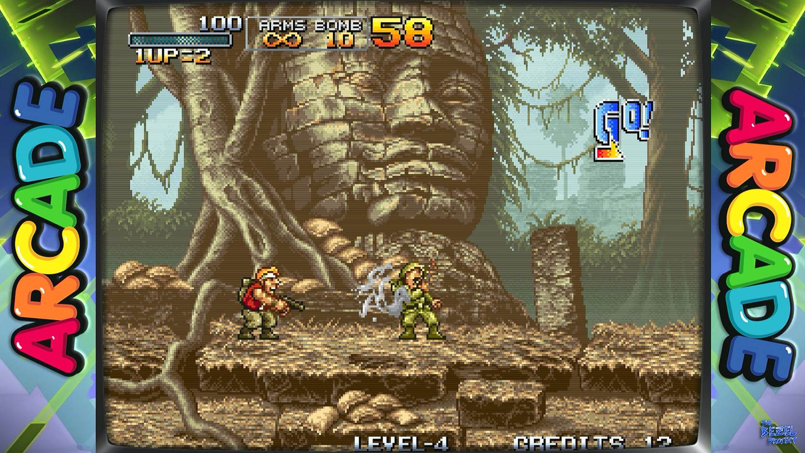

## 总结

根据上面的的测试结果，得出边框的使用方法。

### 边框优先度

<u>游戏边框 > 平台边框 > 系统边框</u>

### 自定义边框

根据上面的说明，虽然下载边框很方便，有可能我不喜欢某一个边框，我可以替换成喜欢的边框。

下载边框可以在GitHub上搜索bezel关键词，或者参考 [The Bezel Project](https://github.com/thebezelproject?tab=repositories)
