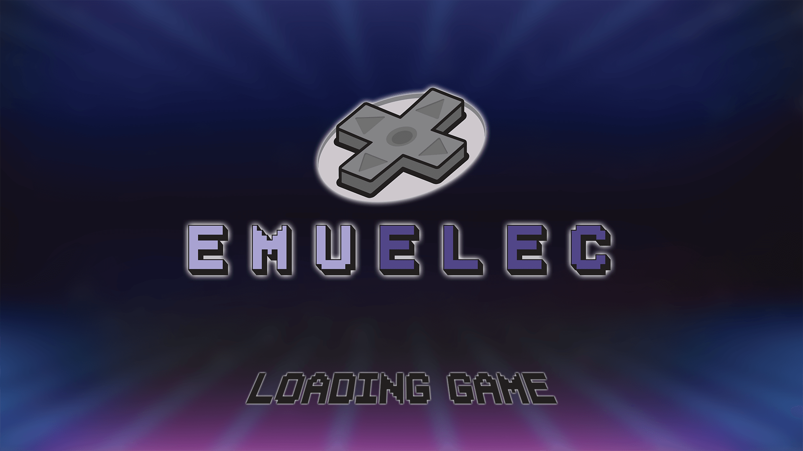
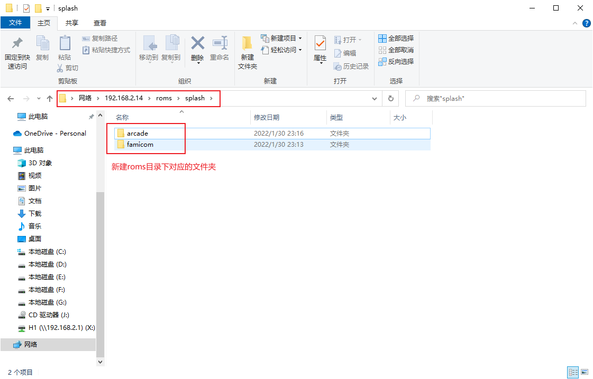
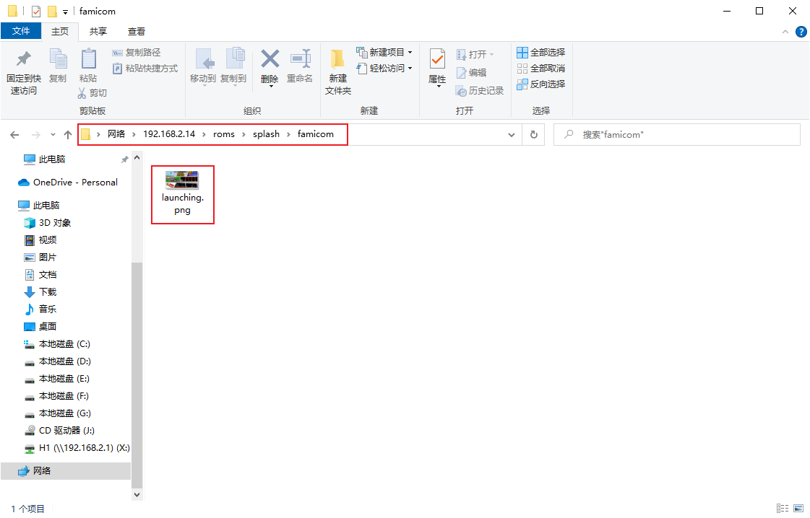
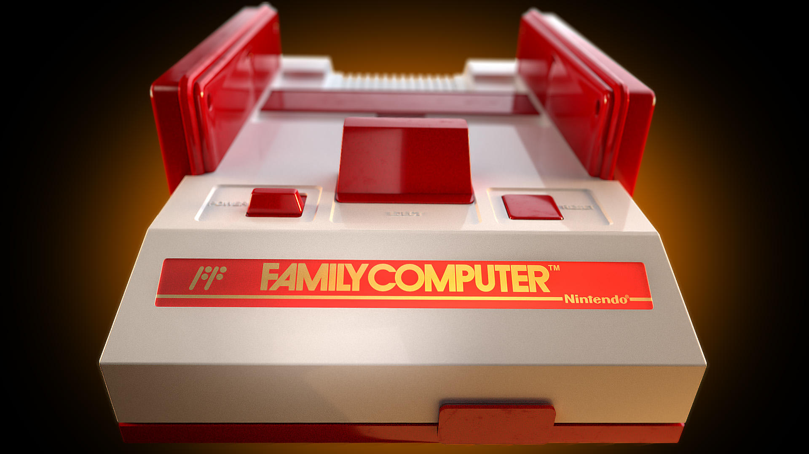
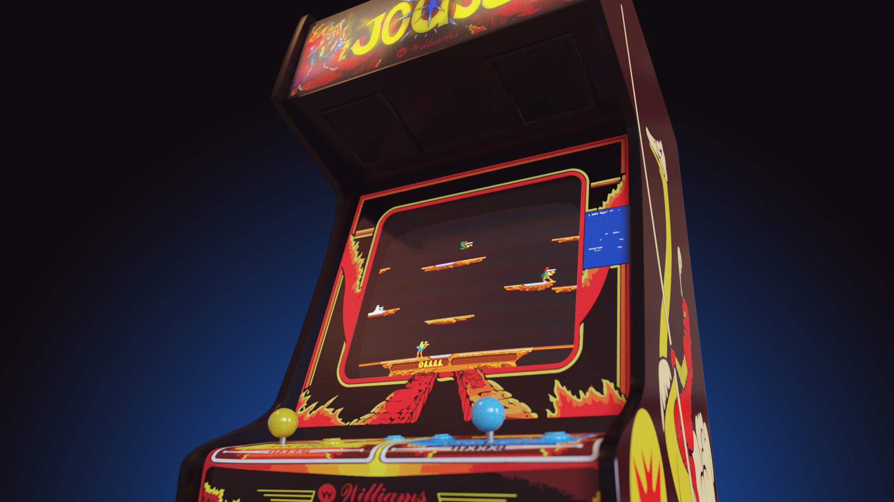
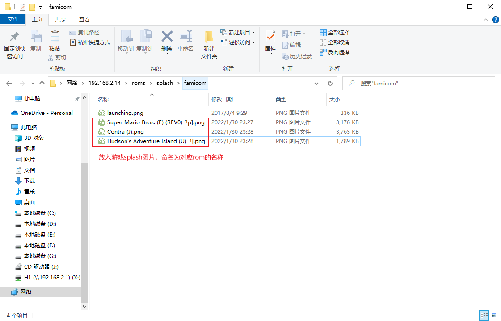
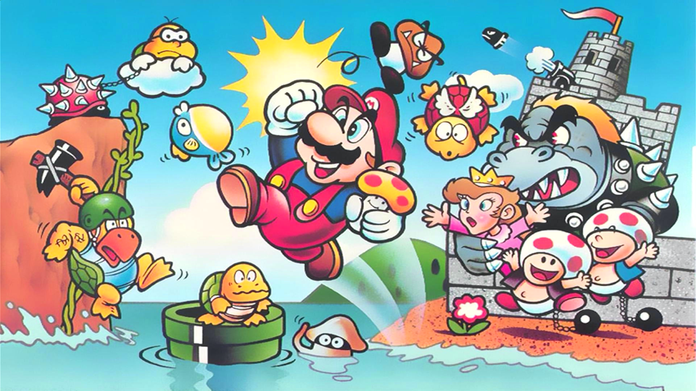
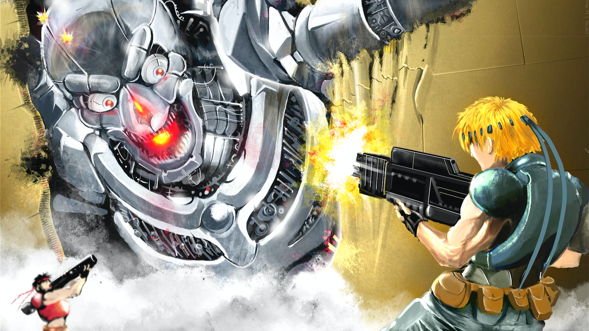

关于闪图（splash），可能不清楚是什么意思。

::: tip 闪图（splash）是什么？

就是在我们进入游戏的时候，出现的画面，称之为闪图（splash）。

:::

## 系统闪图

和边框（bezel）一样，也是可以更改设置的，系统默认的是闪图是`/storage/.config/splash/loading-game.png`，暂且称之为<u>**系统闪图**</u>。在没有配置其他闪图之前，所有的游戏进入是显示的都是下图。（当然可自行替换其他图片，但需要保持文件名不变）

## 配置闪图

那我们先进入闪图的所在目录：`roms/splash`，分别新建对应游戏平台的闪图目录`famicom`和`arcade`，

::: tip 疑问

为什么NEO·GEO平台的游戏闪图目录是`roms/bezels/arcade`呢？而不是`roms/bezels/neogeo`呢？

同上一篇边框设置的文章一样，系统默认是把arcade、bneo、fbn、neogeo、mame、cps1、cps2、cps3这几个平台合并到一起，统一用`roms/splash/arcade`作为它们的闪图目录。

:::

然后，在刚刚新建游戏平台的闪图目录下放入图片文件，并命名为`launching.png`（也可以用`launching.mp4`视频文件，但不建议），暂且将每个游戏平台的闪图目录下的`launching.png`称之为<u>**平台闪图**</u>

再分别进入上面两个游戏平台的游戏，看看游戏的闪图效果

### Famicom平台闪图

### NEO·GEO平台闪图

## 游戏闪图

再然后，我们在游戏平台闪图目录下再放入游戏ROM名的png格式图片，如Famicom平台下放入对应的图片，这种以游戏ROM名命名的图片，暂且称之为<u>**游戏闪图**</u>（如`Contra (J).png`）

再次进入Famicom的游戏看看闪图效果

- 冒险岛

- 超级马里奥

- 魂斗罗

## 总结

根据上面的的测试结果，得出闪图的使用方法。

### 闪图优先度

游戏闪图 > 平台闪图 > 系统闪图

### 自定义闪图

根据自己的喜好，可随意设定自己的闪图。
