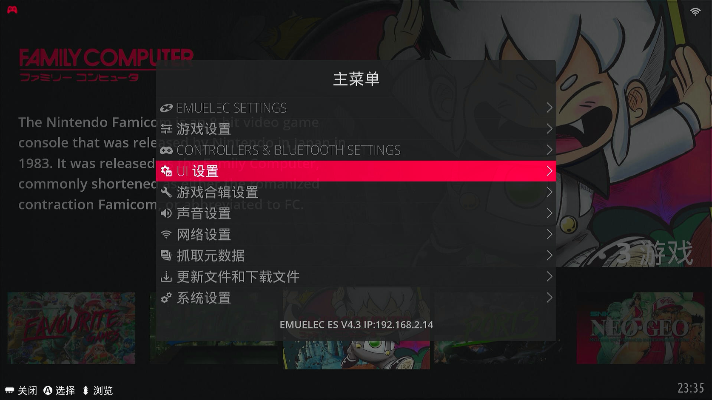
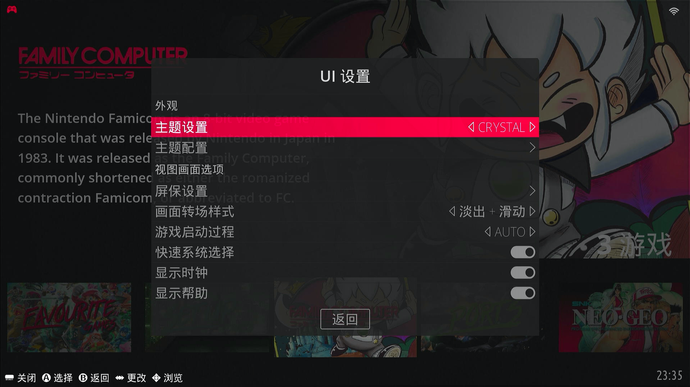

## 下载主题

按下手柄的<kbd>START</kbd>键调出【主菜单】，选择【更新文件和下载文件】

选择【主题】

选择要下载的主题（右上方有下载进度）

下载完成后，到主题路径查看，`es-theme-alekfull-EmuELEC`就是刚刚下载的主题，也可以直接把下载好的主题直接放到主题路径下

主题路径：`/Storage/.config/emulationstation/themes`

## 切换主题

然后回到【主菜单】➡【UI设置】

选择【主题设置】（此处还有主题的详细设置，此处略过）

返回到主界面，会提示重启Emulationstation，已经切换到刚刚下载的`es-theme-alekfull-EmuELEC`主题了

- 主界面

- 游戏列表界面

## 主题修改

关于主题修改，就是修改主题目录下的具体图片及配置。

> 比如修改原生主题Crystal：
>
> 进入`/Storage/.config/emulationstation/themes/Crystal`目录，可以修改相关的配置文件。

对前端了解的小伙伴可以研究研究，此处不做说明。
