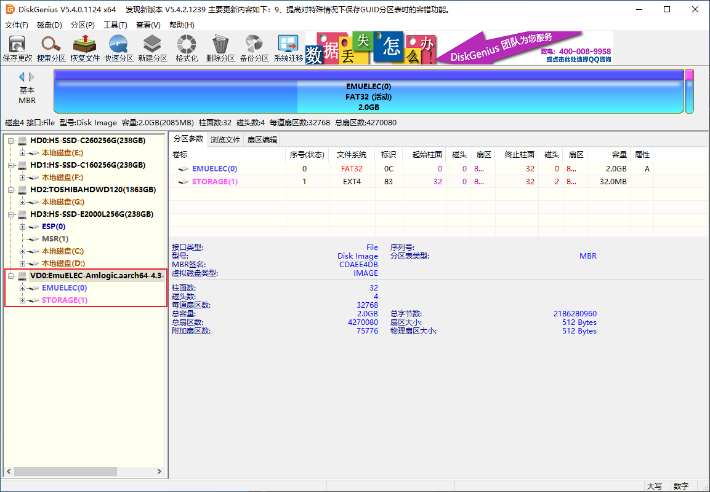
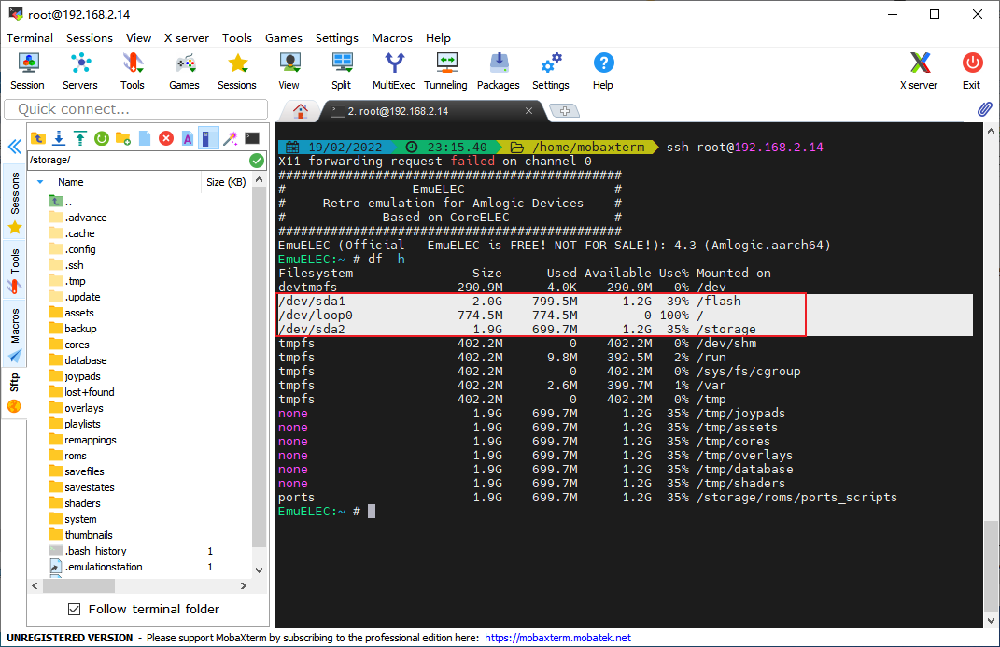

## 分区说明

在将img镜像烧录到TF卡/U盘后，会产生两个分区：

- **EMUELEC分区**：用于系统启动的文件，例如`dtb.img` 、`SYSTEM`、`kernel.img`等系统文件
- **STORAGE分区**：空（只有扩容用的文件）



## 目录结构

EmuELEC系统启动后，挂载信息如下：

```shell
/dev/sda1 2.0G 799.5M 1.2G 39% /flash
/dev/loop0 774.5M 774.5M 0 100% /
/dev/sda2 1.9G 699.7M 1.2G 35% /storage
```



- **EMUELEC分区**被挂载为`/flash`
- **STORAGE分区**被挂载为`/storage`
- **SYSTEM文件**通过`/dev/loop0`被挂载为系统根目录`/`

所以，用户能修改的仅仅是`/flash`和`/storage`目录下的文件，`/usr`目录下的文件是不能修改的。

root用户的home目录被定位到`/storage`并非`/root`。

## 目录文件

**常用目录说明**

| 目录位置                                  | 作用                                 |
| ----------------------------------------- | ------------------------------------ |
| /storage/roms/                            | 同来存放游戏ROM文件（根据平台目录）  |
| /storage/roms/bezels/                     | 存放游戏平台边框文件（根据平台目录） |
| /storage/roms/splash/                     | 存放游戏平台闪图文件（根据平台目录） |
| /storage/.config/emuelec/                 | EmuELEC系统相关配置目录              |
| /storage/.config/emuelec/config/locale/   | EmuELEC系统语言目录                  |
| /storage/.config/emulationstation/        | EmulationStation前端目录             |
| /storage/.config/emulationstation/themes/ | EmulationStation前端主题目录         |
| /usr/bin/ports/                           | Ports游戏平台相关目录（无法修改）    |
| /usr/bin/scripts/setup/                   | 系统设置SETUP相关目录（无法修改）    |

**常用文件说明**

| 文件位置                                             | 作用                        |
| ---------------------------------------------------- | --------------------------- |
| /usr/bin/bezels.sh                                   | 边框运行脚本（无法修改）    |
| /usr/bin/show_splash.sh                              | 闪图运行脚本（无法修改）    |
| /usr/bin/emuelecRunEmu.sh                            | 游戏ROM启动脚本（无法修改） |
| /storage/.config/emuelec/config/emuelec.conf         | EmuELEC系统设置相关文件     |
| /storage/.config/emulationstation/resources/logo.png | ES画面，可替换更改          |

