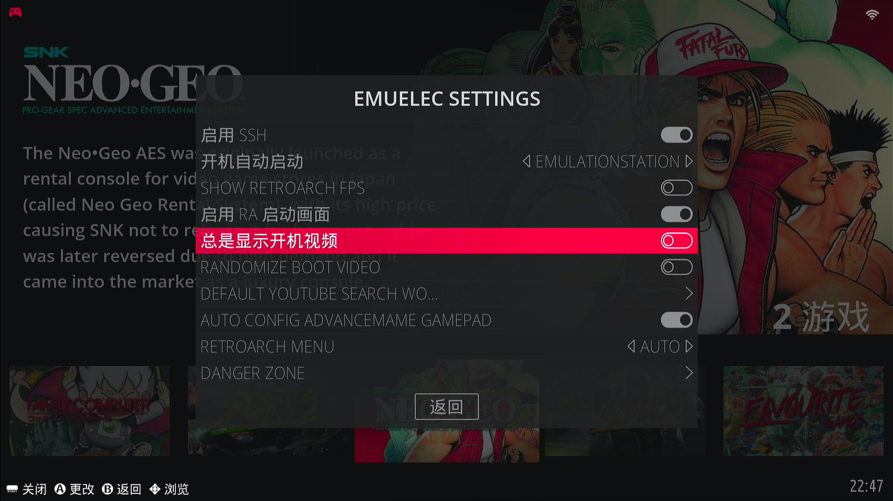

## 开启

按手柄<kbd>START</kbd>键，调出【主菜单】，选择【EMUELEC SETTINGS】


打开【总是显示开机视频】



## 过程

ssh连接到EmuELEC系统，输入以下命令：

```shell
cp /usr/bin/show_splash.sh /storage/.config/emuelec/scripts/
```


进入目录：`/storage/.config/emuelec/scripts/`，打开`show_splash.sh`文件，

将<u>VIDEOSPLASH="/usr/config/splash/emuelec_intro_1080p.mp4"</u>修改成

<u>VIDEOSPLASH="/storage/.config/splash/emuelec_intro_1080p.mp4"</u>，然后保存


再进入目录：`/storage/.config/`，打开`autostart.sh`文件，添加如下内容，然后保存

```shell
# Show splash creen 
/storage/.config/emuelec/scripts/show_splash.sh intro
```


## 更换

最后进入目录：`/storage/.config/splash/`，将此目录下的`emuelec_intro_1080p.mp4`视频文件替换成你的视频，保持文件名称不变，仍是`emuelec_intro_1080p.mp4`这个名字。

以上步骤完成之后，重启EmuELEC系统，看看开机视频是否更改成功了。
