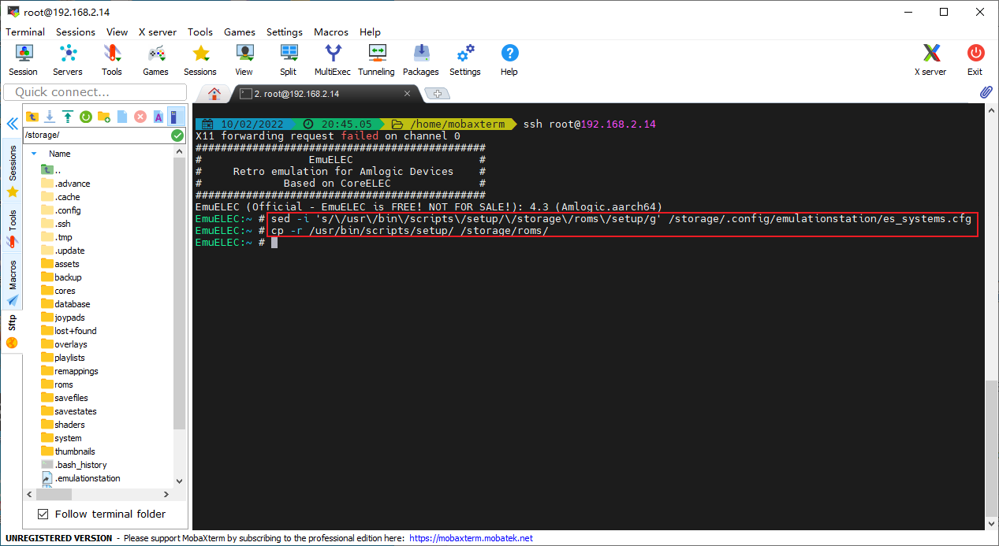
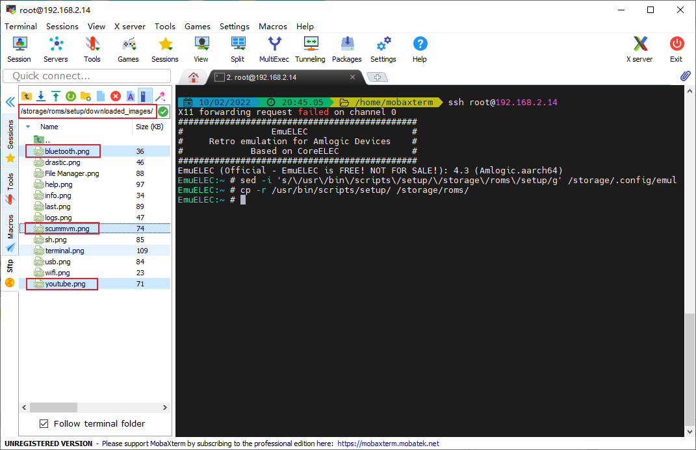
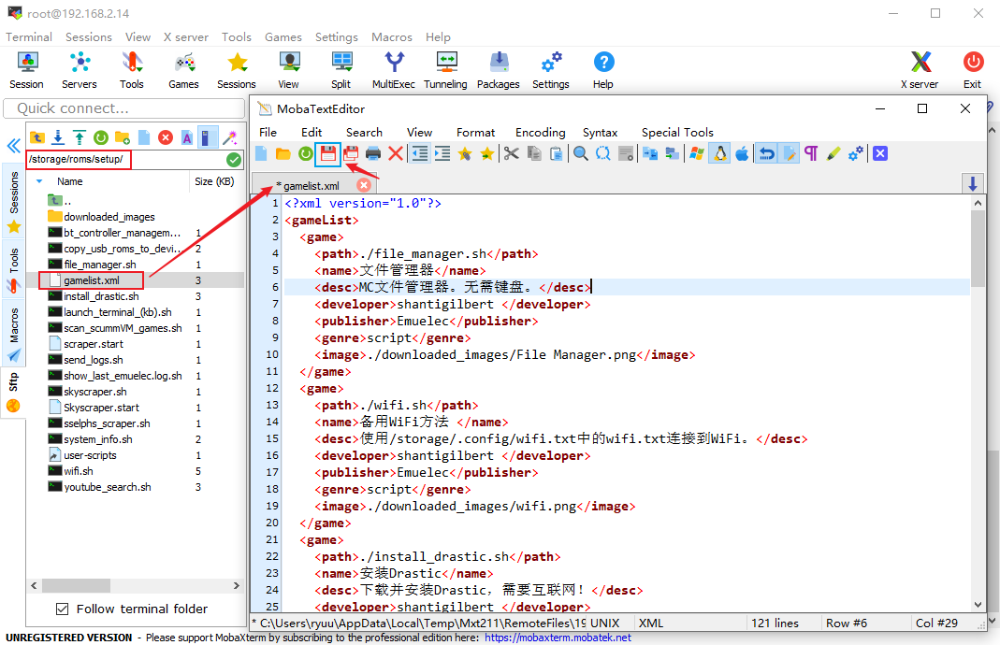
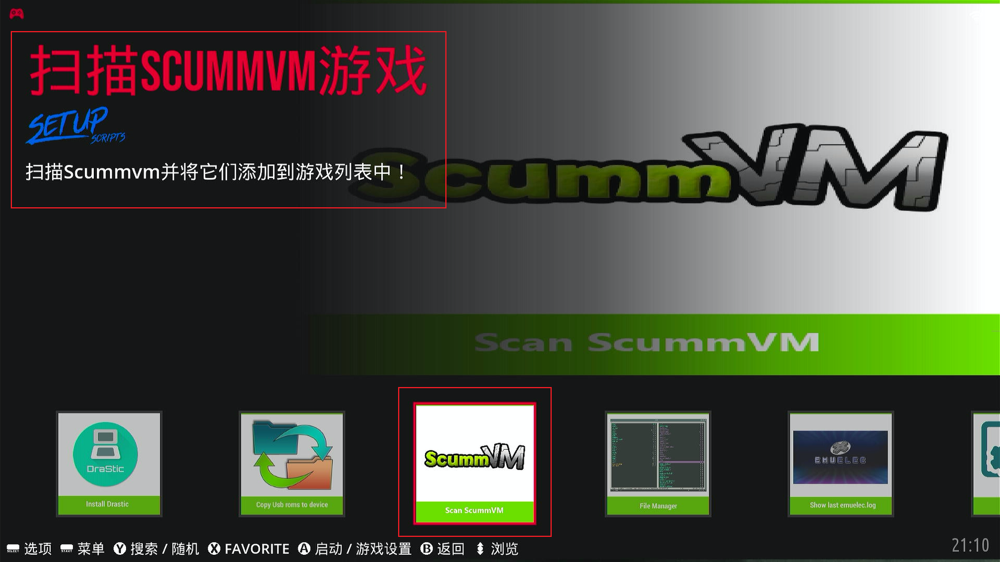

## 前提

我们修改了语言为中文后，平台游戏都有对应的游戏列表可以更改成中文，但是这个系统的设置菜单SETUP却无法修改，其实也是可以的。正好也可以顺便解决国内小伙伴[安装NDS模拟器drastic](04.install_drastic.md)失败的问题。

## 修改SETUP菜单路径

把SETUP菜单的路径修改成`/storage/roms/setup`，并将原SETUP菜单路径下内容复制到`/storage/roms/setup`，执行以下命令：

```shell
sed -i 's/\/usr\/bin\/scripts\/setup/\/storage\/roms\/setup/g' /storage/.config/emulationstation/es_systems.cfg
cp -r /usr/bin/scripts/setup/ /storage/roms/
```



上面的命令，就是修改`es_systems.cfg`文件的内容和复制SETUP菜单内容。

## 补全SETUP菜单图片

上面两条命令完成后，原版的SETUP菜单下的几个选项（youtube、bluetooth、scummvm）没有图片，那么我们自己补几张图片，将下列3张图片放到`/storage/roms/setup/downloaded_images`目录下，就补全了SETUP菜单图片。（图片下载到本站的【资源下载】➡【工具】）

- `youtube.png`
- `bluetooth.png`
- `scummvm.png`



## 修改SETUP菜单为中文

打开`/storage/roms/setup/gamelist.xml`，可以将<u>**名字**</u>和<u>**描述**</u>修改为中文（即name标签和desc标签，需要自己翻译修改），然后保存。



重启EmulationStation再进入SETUP菜单看看，已经修改成中文了。



## PORTS游戏平台

当然，还有系统自带的ports游戏平台，也是可以修改的。根据`es_systems.cfg`文件里ports平台的相关信息，打开`/storage/roms/ports_scripts/gamelist.xml`，进行翻译修改成中文即可。

```xml
    <system>
    <name>ports</name>
    <fullname>Ports</fullname>
    <manufacturer>Ports</manufacturer>
    <release>Varies</release>
    <hardware>port</hardware>            
    <path>/storage/roms/ports_scripts</path>    <!--ports平台路径-->
    <extension>.sh .SH</extension>
    <command>/usr/bin/bash %ROM% -P%SYSTEM% --core=%CORE% --emulator=%EMULATOR% --controllers="%CONTROLLERSCONFIG%"</command>
    <platform>ports</platform>
    <theme>ports</theme>
    </system>
```

::: tip 关于es_systems.cfg文件

`es_systems.cfg`文件：全路径名称为`/storage/.config/emulationstation/es_systems.cfg`。

它是EmuELEC系统的前端EmulationStation（后面简称ES）的平台配置文件，也就是我们看到的游戏平台的分类及相关配置都在这个文件里。比如NEOGEO平台的配置内容：

```xml
    <system>
        <name>neogeo</name>                            <!--平台名称-->
        <fullname>SNK Neo-Geo</fullname>            <!--平台全称-->
        <manufacturer>SNK</manufacturer>            <!--平台开发商-->
        <release>1990</release>                        <!--平台发行年份-->
        <hardware>console</hardware>                <!--平台控制器-->
        <path>/storage/roms/neogeo</path>            <!--平台游戏存放路径-->
        <extension>.7z .7Z .zip .ZIP</extension>    <!--平台游戏ROM扩展名-->
        <command>emuelecRunEmu.sh %ROM% -P%SYSTEM% --core=%CORE% --emulator=%EMULATOR% --controllers="%CONTROLLERSCONFIG%"</command>        <!--调用命令emuelecRunEmu.sh运行游戏-->
        <platform>neogeo</platform>                    <!--平台-->
        <theme>neogeo</theme>                        <!--主题-->
        <emulators>                                    <!--模拟器相关-->
            <emulator name="libretro">                <!--模拟器-->
                <cores>                                    <!--模拟器核心相关-->
                    <core default="true">fbneo</core>    <!--模拟器默认核心-->
                    <core>mame2003_plus</core>            <!--模拟器其它核心-->
                    <core>fbalpha2012</core>            <!--模拟器其它核心-->
                    </cores>
            </emulator>
        </emulators>
    </system>
```

如需修改相关内容，如添加模拟器核心、修改默认模拟器核心等，按照正确格式修改

:::
