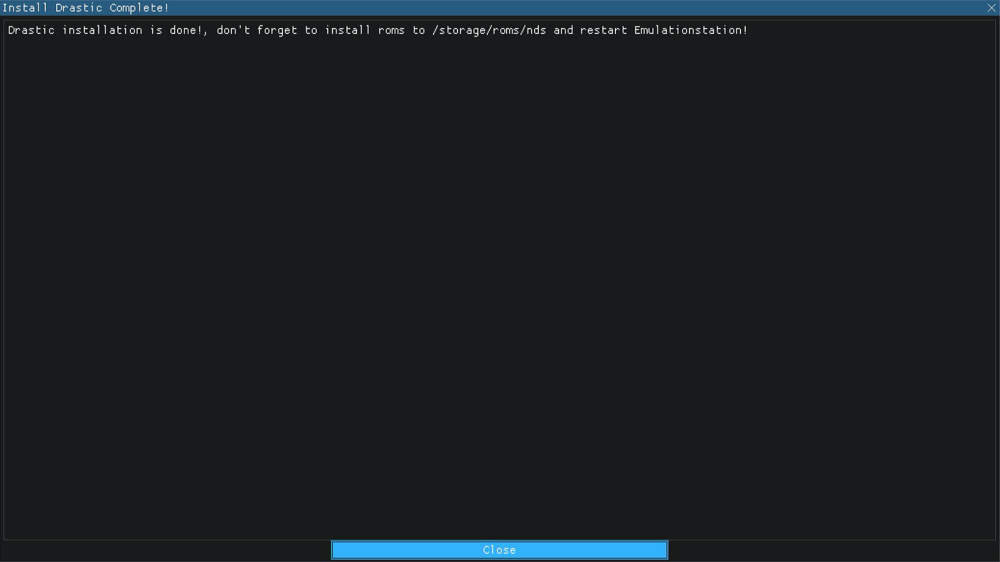
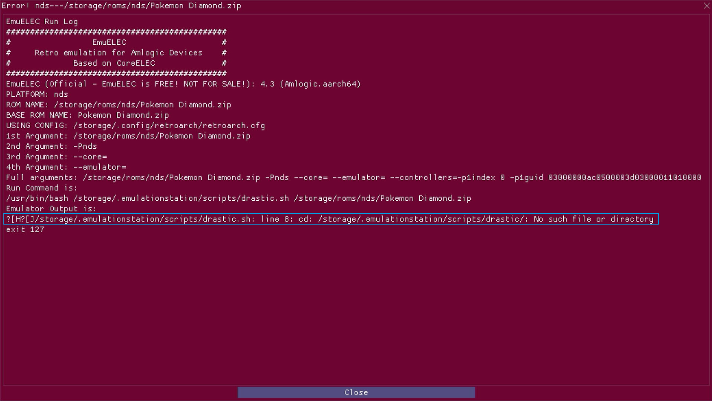
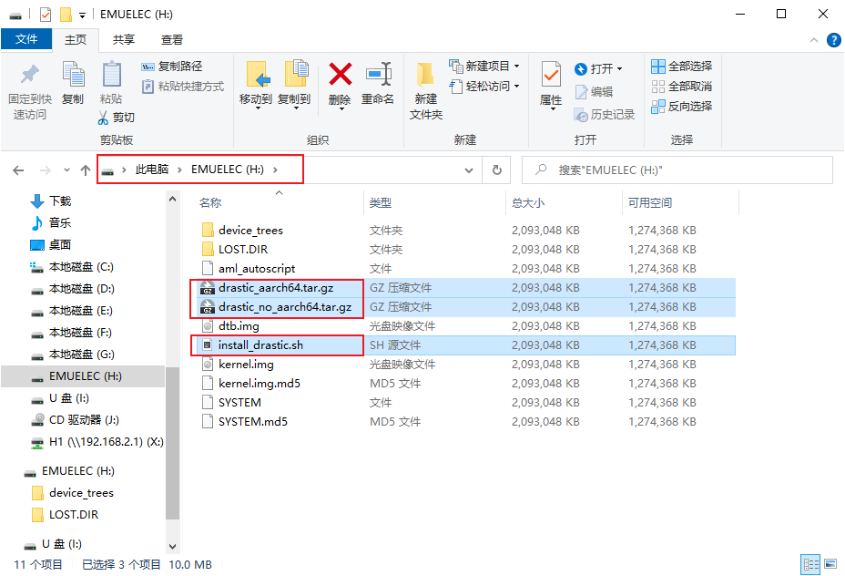
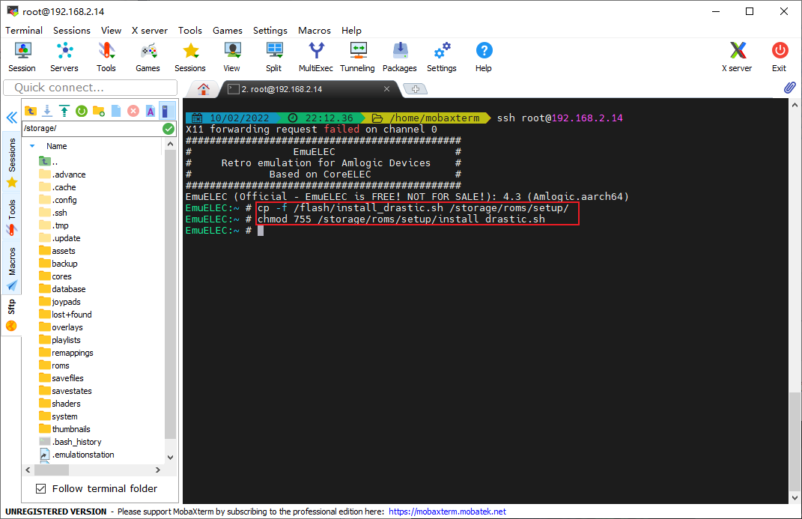
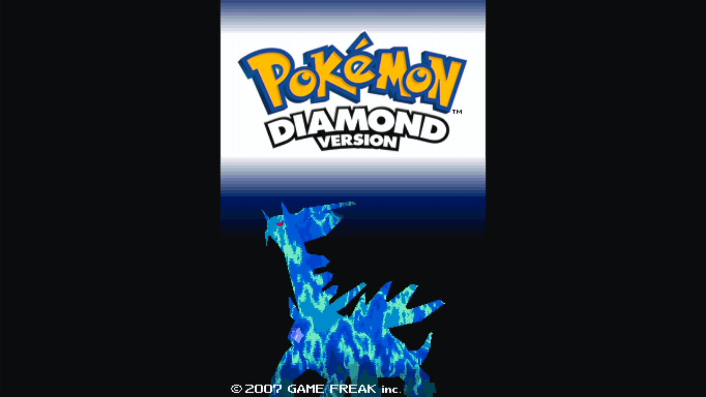

## 前提

EmuELEC系统是支持Nintendou的NDS平台的，但是系统没有直接配置好模拟器，只提供了一个安装选项。进入设置SETUP菜单，选择【Install Drastic】进行安装Drastic，提示安装完成（实际应该没有安装成功，或者出现错误提示：<u>wget: error getting response: Connection reset by peer</u>）。



然后把NDS平台的游戏ROM文件放入roms对应目录下，重启EmulationStation之后进入NDS平台游戏，出现错误：



下面就来分析一下原因，如何解决这个问题。

## 原因分析

其实，找到安装脚本`/storage/roms/setup/install_drastic.sh`（[修改系统设置菜单](03.reset_setup.md)之后的位置，原位置为`/usr/bin/scripts/setup/install_drastic.sh`），查看部分内容：

```shell
...
if grep -q "aarch64" /etc/motd; then
    LINK="https://raw.githubusercontent.com/shantigilbert/binaries-1/master/drastic.tar.gz"
else
    LINK="https://raw.githubusercontent.com/shantigilbert/binaries/master/odroid-xu4/drastic.tar.gz"
fi

ES_FOLDER="/storage/.emulationstation"
LINKDEST="$ES_FOLDER/scripts/drastic.tar.gz"
CFG="$ES_FOLDER/es_systems.cfg"
EXE="emuelecRunEmu.sh"

mkdir -p "$ES_FOLDER/scripts/"

wget -O $LINKDEST $LINK
...
```

从上面的脚本内容或报错信息，可以看出是下载`drastic.tar.gz`文件时出错了。

## 解决方法

前面[修改系统设置菜单](03.reset_setup.md)完成后，到本站的【资源下载】➡【工具】下载以下三个文件：

- `install_drastic.sh`（脚本已经修改）
- `drastic_aarch64.tar.gz`
- `drastic_no_aarch64.tar.gz`

然后把这三个文件放入到EmuELEC启动盘的EMUELEC分区的根目录



然后启动EmuELEC系统，ssh连接到EmuELEC，然后执行下面命令：

```shell
cp -f /flash/install_drastic.sh /storage/roms/setup/
chmod 755 /storage/roms/setup/install_drastic.sh
# 将文件/storage/roms/setup/install_drastic.sh替换成下载的install_drastic.sh
# 修改install_drastic.sh的权限
```



然后再次选择【Install Drastic】进行安装Drastic，安装完成之后再进入游戏试试看，哦了！正常进入游戏界面。只是手柄按键需要重新映射一下。



## 配置Drastic

Drastic虽然安装好了，但是还需要进一步配置。先把游戏ROM文件放入roms对应目录下，然后进入此平台游戏，会发现手柄按键映射“驴头不对马嘴“。此时，需要借一个外接USB键盘进行辅助映射。按下键盘<kbd>M</kbd>键，在菜单里，选择【Configure  Controls】，可对手柄进行映射。

具体内容可参照[人中日月大佬帖子](https://post.smzdm.com/p/ax0r9n23/)
