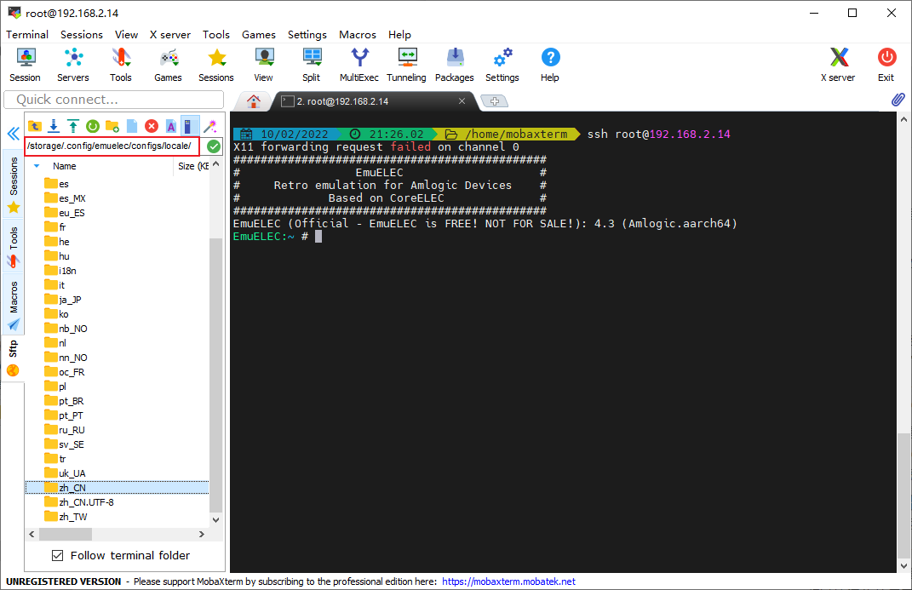
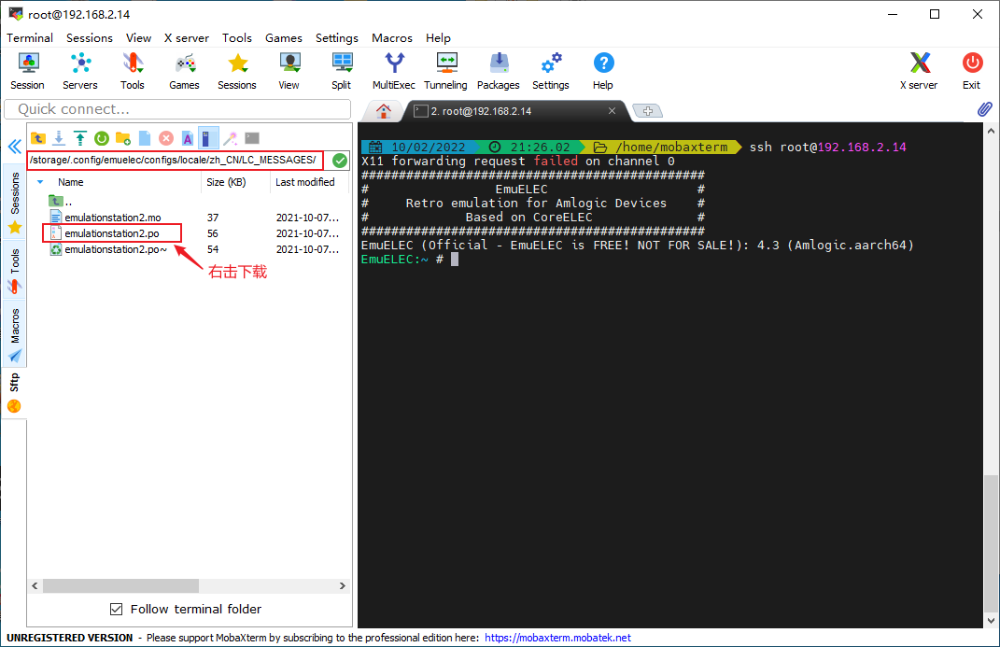
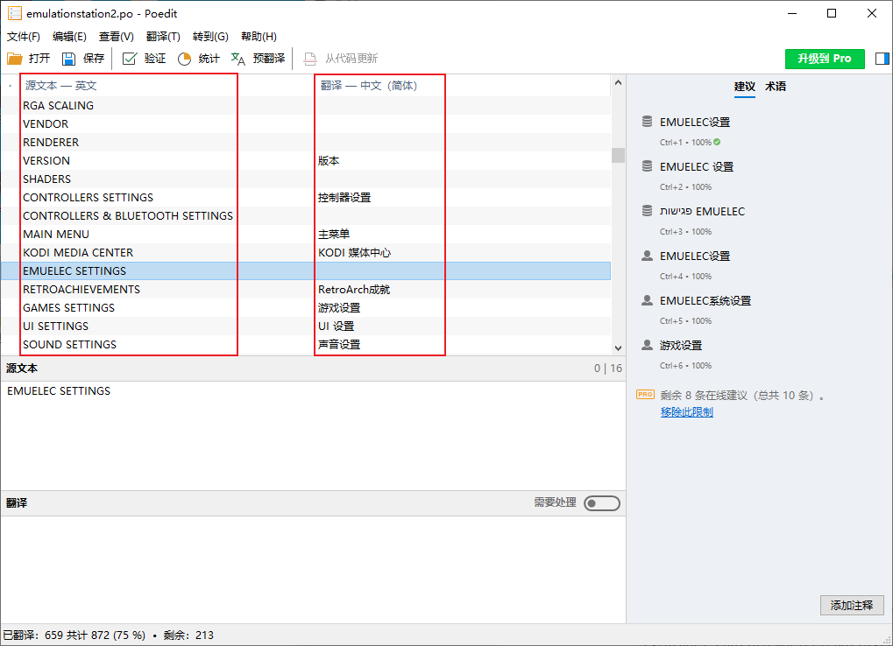
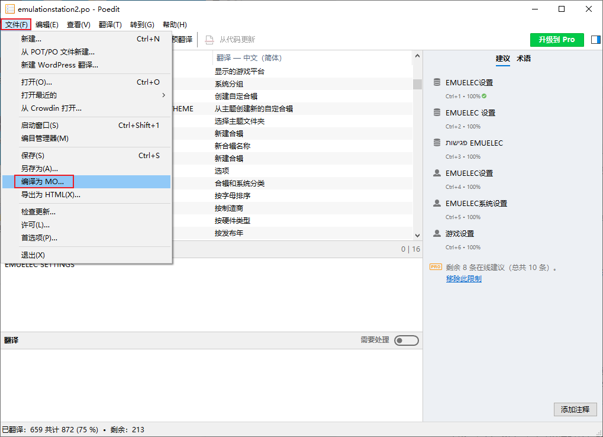
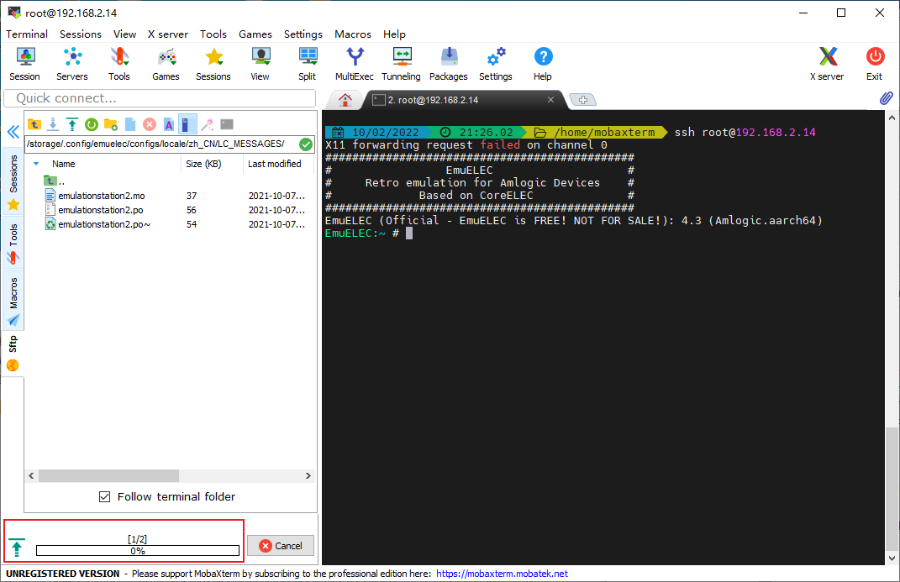
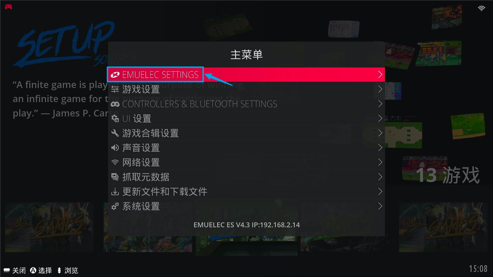
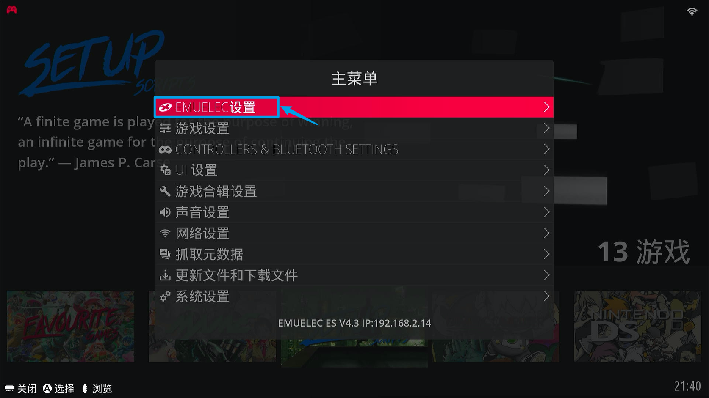
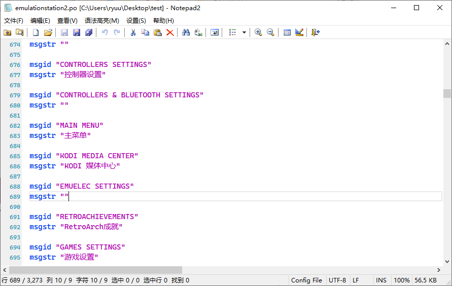

## 前提

前面的【玩法教程】系列的【[EmuELEC基本设置](../guide/02.settings.md#语言时区设置)】中虽然将系统设置成中文，但是有些系统显示仍然是英文。那么如何能把那些没有完全汉化的部分给汉化呢？

这就需要对汉化文件进行修改编译了。

## 过程

找到系统语言包路径：`/storage/.config/emuelec/configs/locale/`，这里已经有很多语言的翻译目录



找到我们需要汉化的中文路径：`/storage/.config/emuelec/configs/locale/zh_CN/LC_MESSAGES`，将此目录下的`emulationstation2.po`文件复制出来，放到本地。



这个文件就是需要我们修改的，首先下载安装软件[Poedit](https://poedit.net/)，用Poedit打开`emulationstation2.po`，对文件里没有翻译的部分进行补充翻译，翻译完成后保存。



再选择【文件】➡【编译为MO...】，名字默认为`emulationstation2.mo`即可



最后将本地修改编译后的两个文件`emulationstation2.po`和`emulationstation2.mo`复制替换`/storage/.config/emuelec/configs/locale/zh_CN/LC_MESSAGES`的对应两个文件。



再重启EmulationStation，看看系统相关的设置信息，是不是已经变成上面修改过的汉化信息了呢？（下图未完全汉化，仅作测试对比）

- 修改前



- 修改后



## 补充

如果`emulationstation2.po`中缺少某些项目信息的源文本，可以用文本编辑器打开`emulationstation2.po`自行添加一对（源文本和翻译文本），再重新编译为MO文件进行替换。

```
msgid "English"
msgstr "中文"
```



::: tip 关于.mo、.po格式文件

**.mo文件是什么？**

`.mo`是Machine Object（机器对象）的缩写形式，它是面向计算机的、由`.po`文件通过GNU gettext工具包编译而成的二进制文件，应用程序通过读取`.mo`文件使自身的界面转换成用户使用的语言，如简体中文。`.mo`是一个二进制文件，不能直接编辑。

**.po文件是什么？**

`.po`是Portable Object（可移植对象）的缩写形式，它是面向翻译人员的、提取于源代码的一种资源文件。`.po`文件可以用任何编辑器如poEdit，vi，Emacs，editplus打开，交给翻译人员来将其中的文字翻译成本国语言。

**.pot文件是什么？**

`.pot`文件是一种模板文件，其实质与`.po`文件一样，其中包含了从源代码中提取所有的翻译字符串的列表，主要提供给翻译人员使用。

**通常汉化步骤：**

1. 将`.mo`语言包反编译为`.po`文件
2. 理解`.po`的翻译样式
3. 将英文翻译成中文然后，反编译成`.mo`生成二进制中文语言包
4. 替换测试

:::
