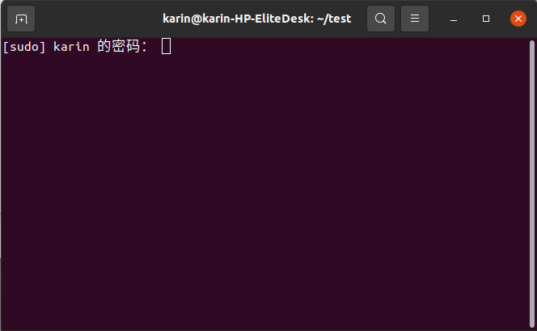

## 准备

- Ubuntu环境（推荐Ubuntu 20.04 LTS x64，并连接到互联网）

- EmuELEC镜像包的`kernel.img`文件
- 解包打包脚本工具`kernel.sh`文件

- 要替换的开机图片`kernel_splash.png`（png格式，分辨率最好为1920x1080）

## 过程

1. 准备文件

   进入Ununtu系统，在你的家目录下新建一个目录（本例：`~/test`），把所需文件放进去

   `kernel.sh`脚本工具请到本站的【资源下载】➡【工具】下载，`kernel_splash.png`请自备

2. 解压`EmuELEC-xxx.img.gz`压缩包

3. 然后挂载`EmuELEC-xxx.img`镜像

4. 挂载后，左侧有两个磁盘分区，进入EMUELEC分区，把`kernel.img`文件复制到之前新建目录（本例：`~/test`）

5. 返回脚本所在目录（本例：`~/test`），并在空白处右击“在终端打开”

6. 输入执行脚本命令：`bash kernel.sh`

7. 需要`sudo`权限，输入用户密码

8. 下载工具，解包（按照提示操作，准备好`kernel_splash.png`图片）

9. 打包完成，新打包好的文件名`kernel.img`

10. 别忘了将挂载的两个分区卸载了

11. 最后，将新打包好的`kernel.img`文件替换EmuELEC启动盘中的`kernel.img`文件。

以上，EmuELEC系统的开机闪图就已经完成替换了，重新启动EmuELEC系统看看效果：

::: tip 关于 kernel.img 文件

本篇文章的第2～4、10步骤可以替换为：

将制作好的EmuELEC启动盘里的`kernel.img`文件复制过来，放到脚本文件`kernel.sh`所在目录（本例：`~/test`）

:::
