## 准备

- Ubuntu环境（推荐Ubuntu 20.04 LTS x64，并连接到互联网）

- EmuELEC镜像包的`SYSTEM`文件

- 解包打包脚本工具`system.sh`文件

## 过程

1. 准备文件

   进入Ununtu系统，在你的家目录下新建一个目录（本例：`~/test`），把所需文件放进去

   `system.sh`脚本工具请到本站的【资源下载】➡【工具】下载

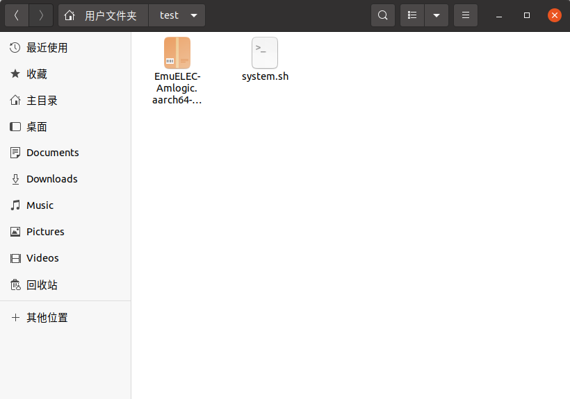

2. 解压`EmuELEC-xxx.img.gz`压缩包

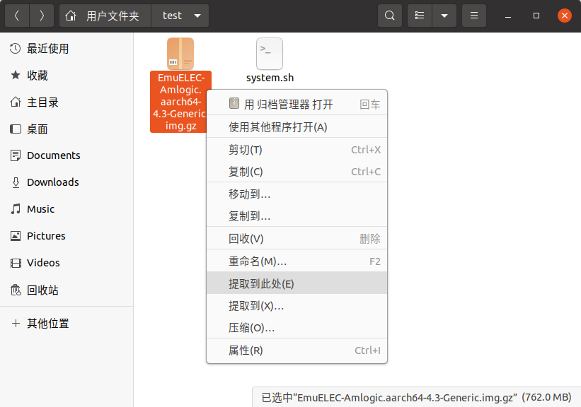

3. 然后挂载`EmuELEC-xxx.img`镜像

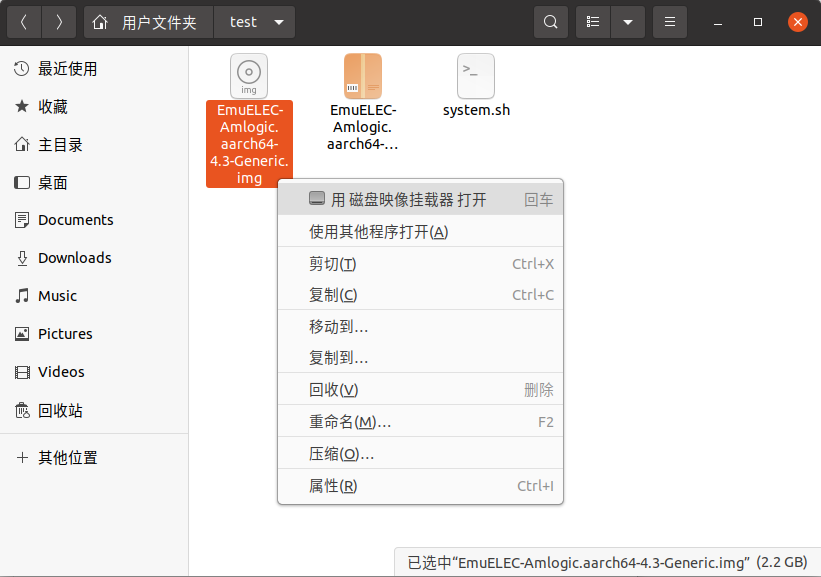

4. 挂载后，左侧有两个磁盘分区，进入EMUELEC分区，把`SYSTEM`文件复制到之前新建目录（本例：`~/test`）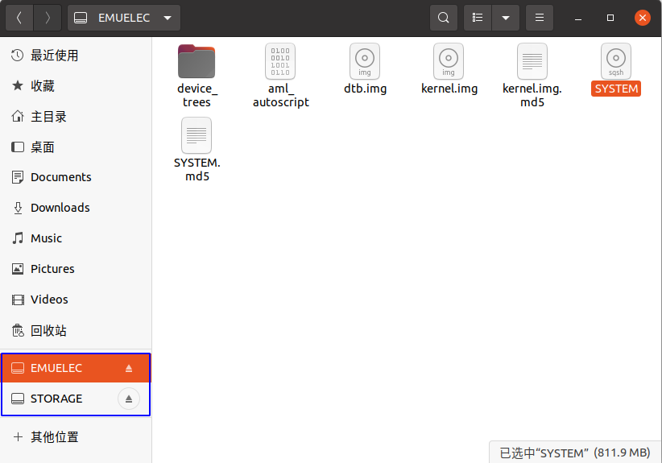

5. 返回脚本所在目录（本例：`~/test`），并在空白处右击“在终端打开”

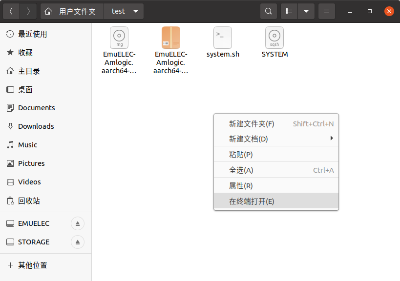

6. 输入执行脚本命令：`bash system.sh`

7. 需要`sudo`权限，输入用户密码

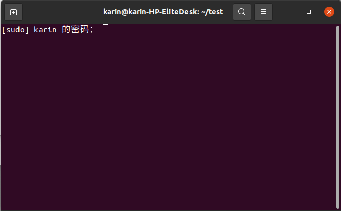

8. 解包中（文件较大，过程比较长）

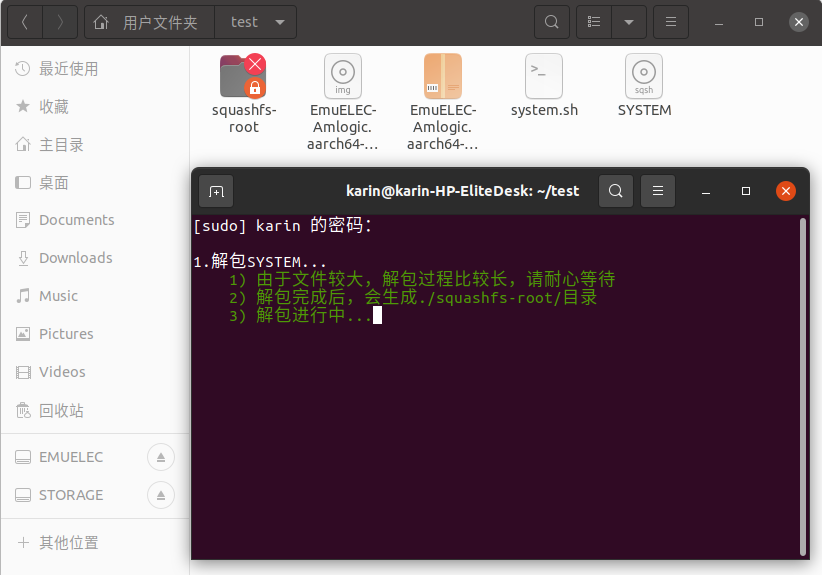

9. 解包完成（多出一个`squashfs-root`目录，就是`SYSTEM`文件解压出来的）

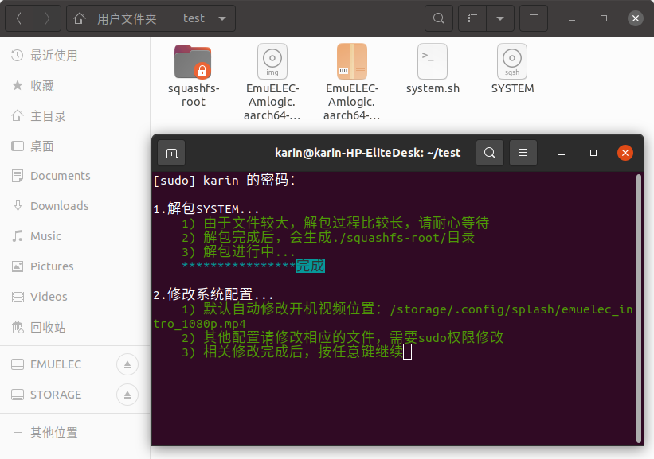

10. 进入`squashfs-root`目录，根据需要修改相关配置（默认修改了开机视频位置）

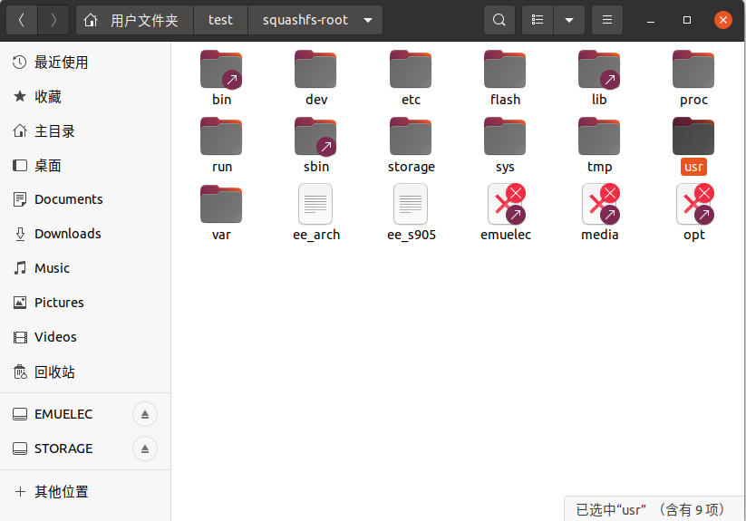

11. 相关配置修改完成之后，下一步打包中（文件较多，过程比较长）

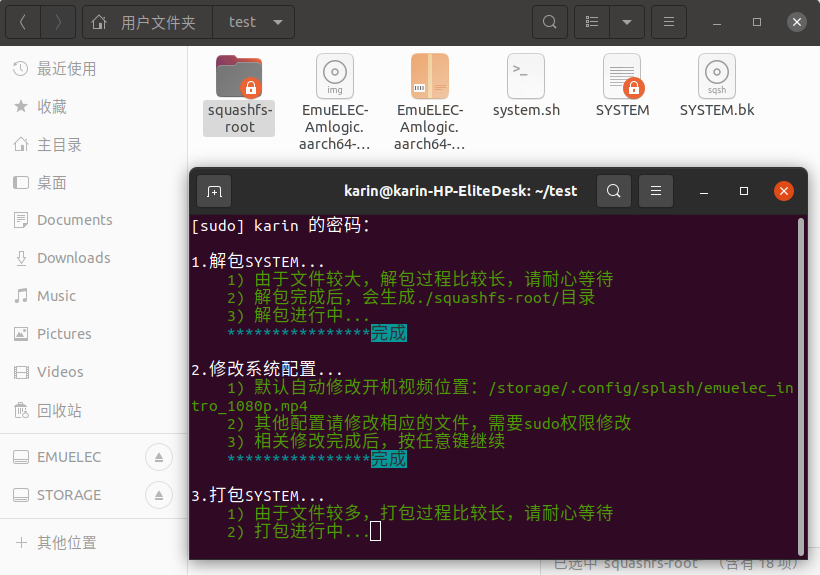

12. 打包完成，新打包好的文件名`SYSTEM`

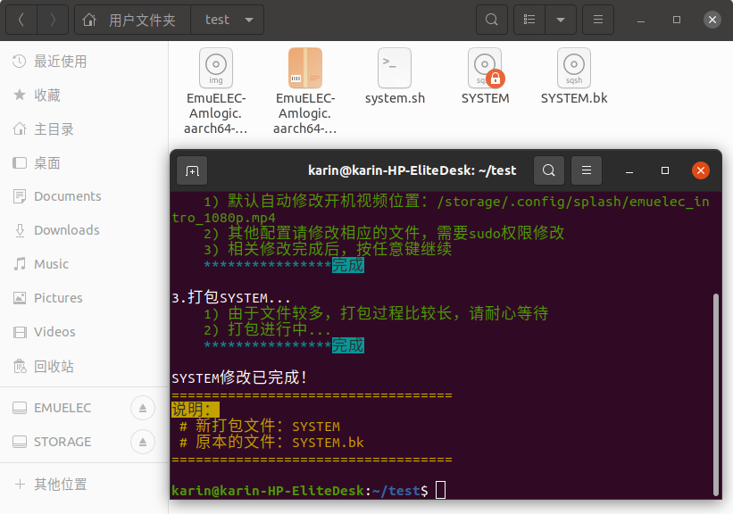

13. 别忘了将挂载的两个分区卸载了

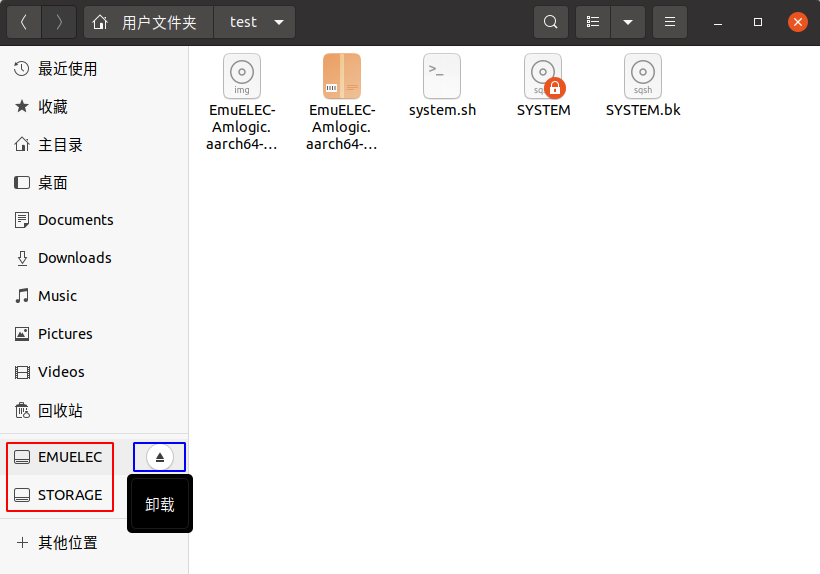

14. 最后，将新打包好的`SYSTEM`文件替换EmuELEC启动盘中的`SYSTEM`文件。

以上，EmuELEC系统的SYSTEM文件就已经完成修改了，开机进入EmuELEC系统，相关配置已经生效。

::: tip 关于 SYSTEM 文件

本篇文章的第2～4、13步骤可以替换为：

将制作好的EmuELEC启动盘里的`kernel.img`文件复制过来，放到脚本文件`kernel.sh`所在目录（本例：`~/test`）

:::
