## 准备

重新打包镜像文件，准确来说应该是修改镜像文件（img格式）。

- Windows环境
- DiskGenius磁盘工具
- 修改过的`kernel.img`文件
- 修改过的`SYSTEM`文件

## 过程

1. 首先将原版镜像解压，再将之前修改的`keinel.img`和`SYSTEM`文件复制到同一个路径

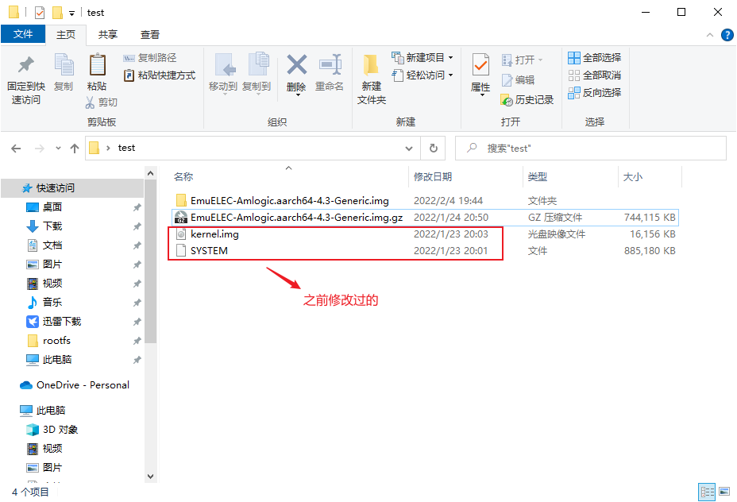

2. 打开DiskGenius磁盘工具，选择【磁盘】菜单，再选择【打开虚拟磁盘文件】

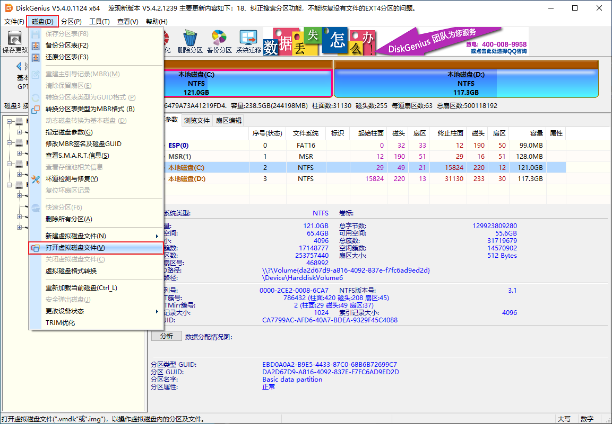

3. 选择刚刚解压的原版镜像文件

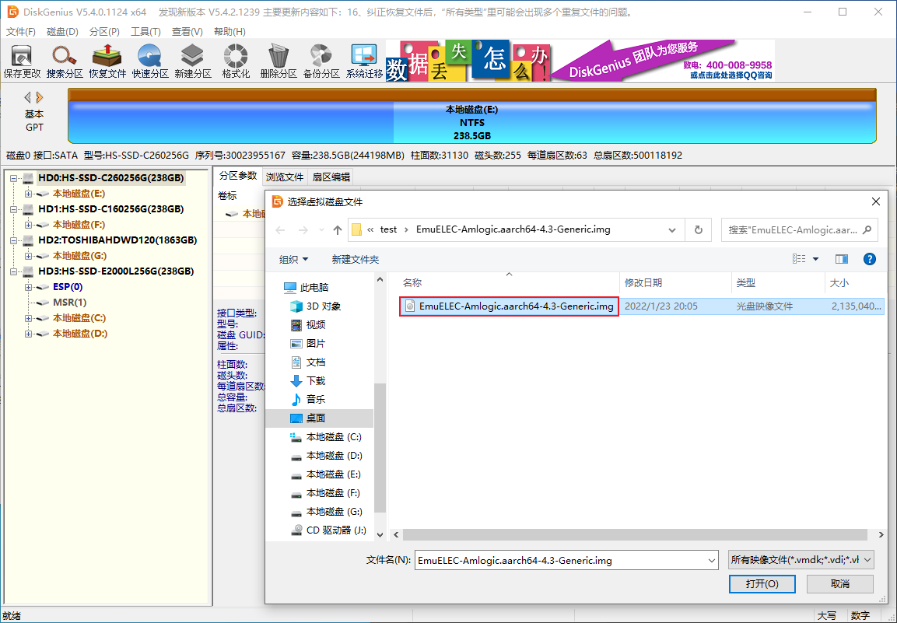

4. 打开后，左侧出现虚拟磁盘文件的分区情况

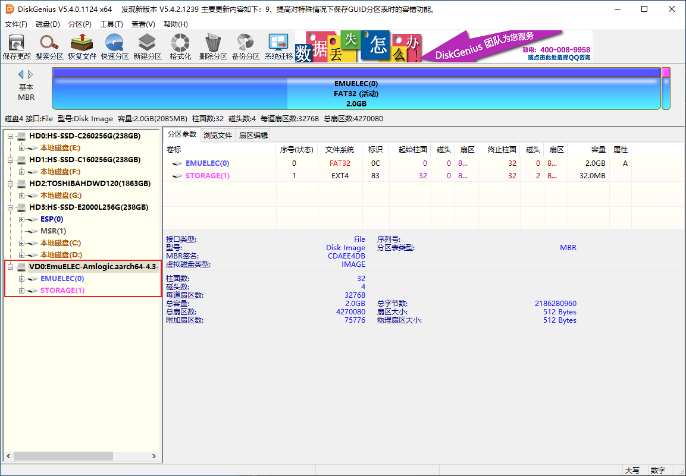

5. 选择EMUELEC分区，选择浏览文件

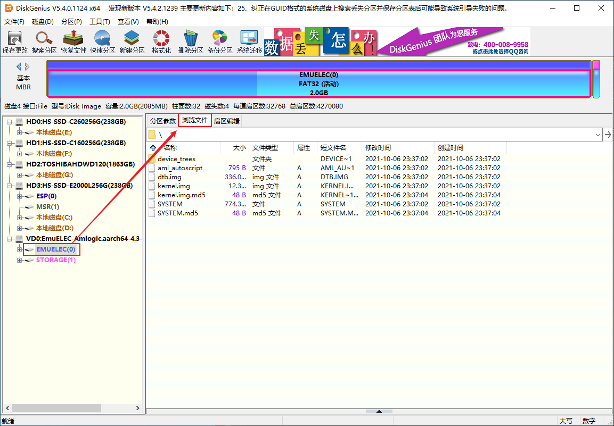

6. 再空白处右击，快捷菜单选择【复制文件到当前分区】

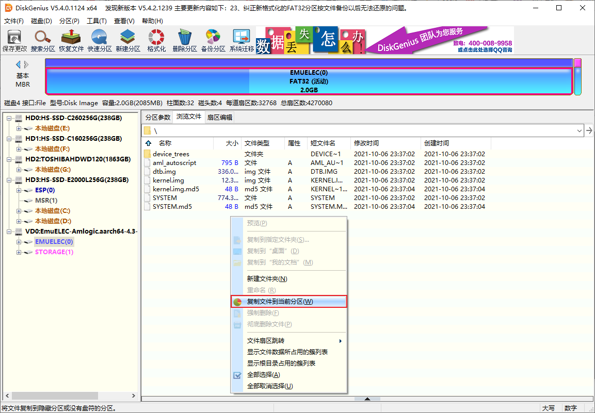

7. 选择之前修改好的`kernel.img`和`SYSTEM`文件

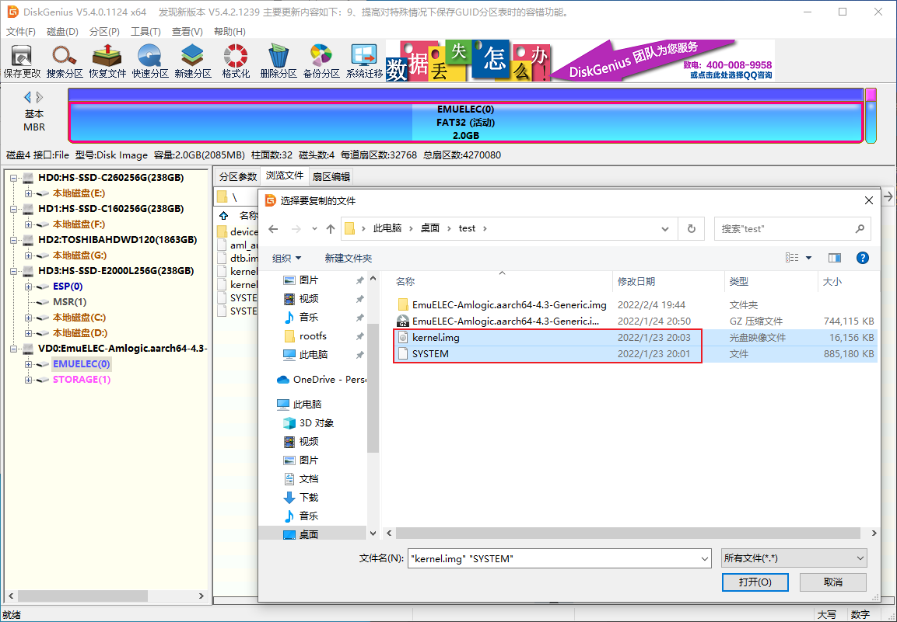

8. 跳出弹窗，选择【全部替换】

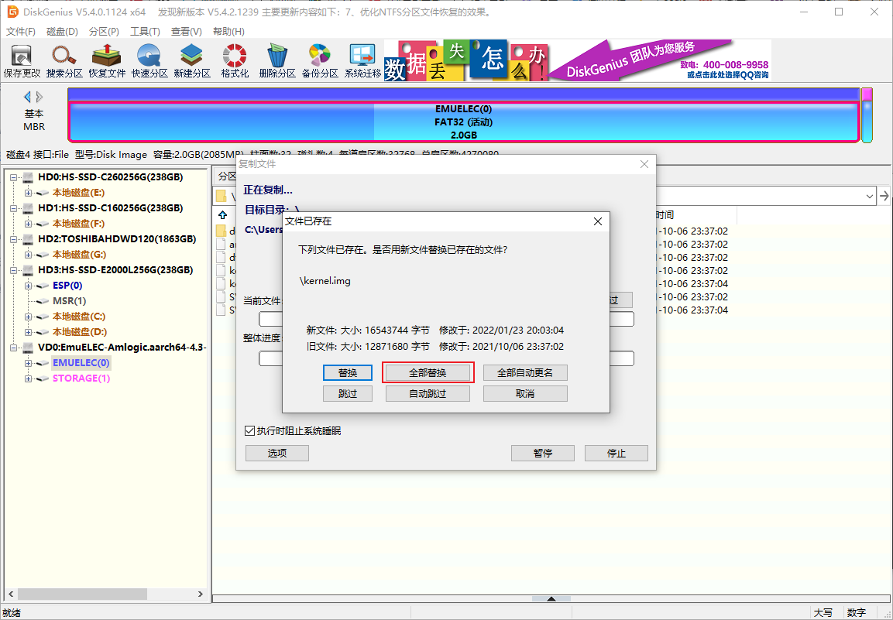

9. 替换完成后，确认这两个文件的时间是否变成之前修改的时间

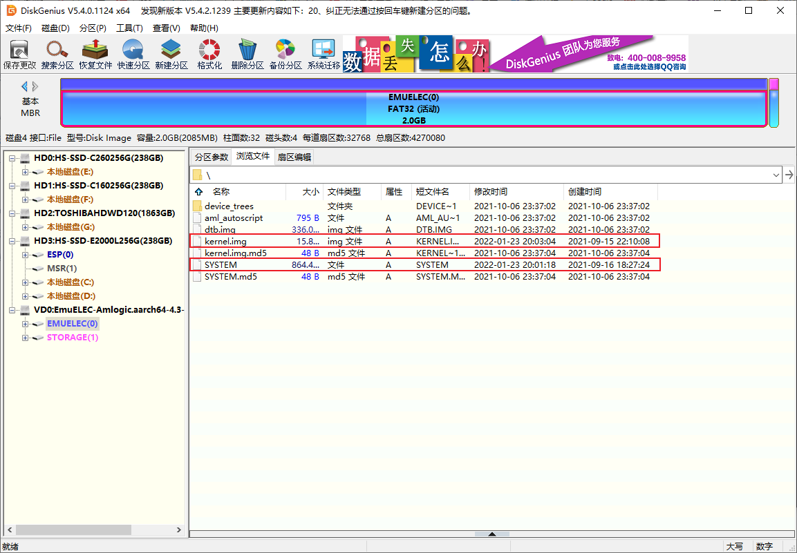

10. 再选择【磁盘】菜单，再选择【关闭虚拟磁盘文件】

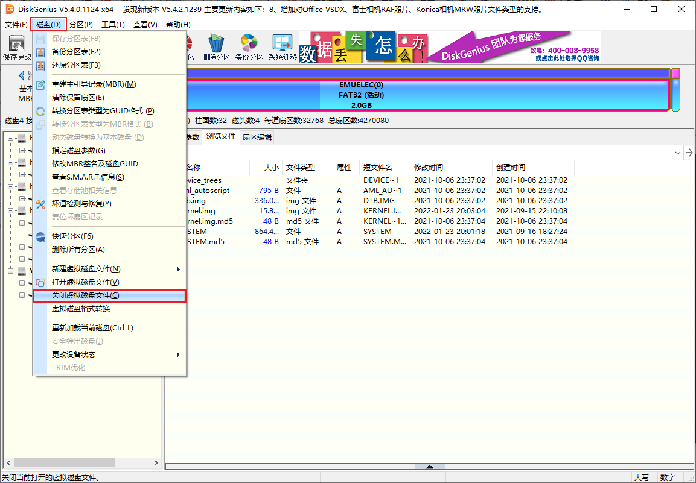

11. 最后再看看镜像文件，时间已经更新为现在时间，说明镜像文件修改成功

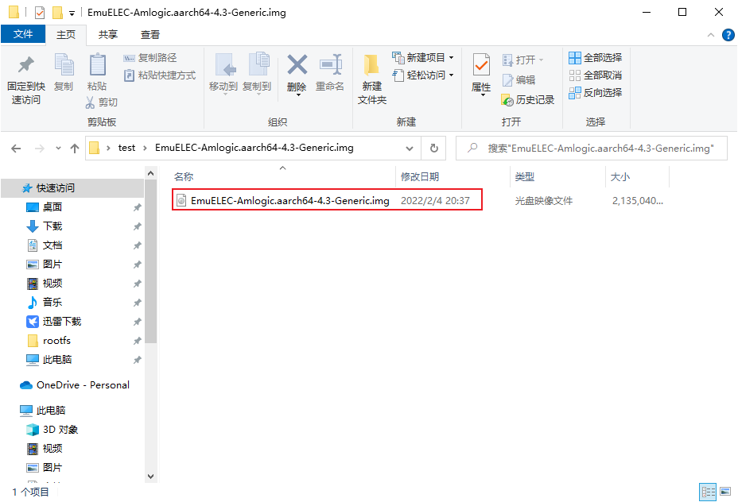

以上，img格式的镜像文件就修改好了。

把上面修改好的镜像文件用烧录工具烧录到你的TF卡/U盘中即可。

::: tip 关于img格式镜像文件

此文没有用Linux下的方法制作img格式镜像文件，是觉得Windows平台下制作修改更简单，当然Linux下也是可以的，就是有点麻烦。下面做个大概介绍：

1. `dd`命令新建空白镜像
2. `losetup`命令挂载空白镜像到loop设备
3. `fdisk`命令对loop设备分区，设置启动分区
4. `losetup -d`命令断开第2步挂载的loop设备
5. `fdisk -l`查看空白镜像的分区情况
6. `losetup`命令将空白镜像的两个分区分别挂载到loop设备
7. `mkfs`命令格式化分区
8. `mount`命令挂载第6步的loop设备到目录
9. 将对应的文件拷贝到挂载目录
10. `umount`命令卸载分区，`losetup -d`命令断开第6步挂载的loop设备
:::